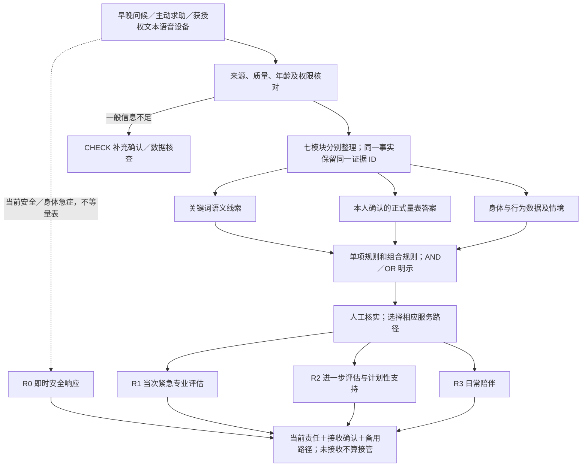
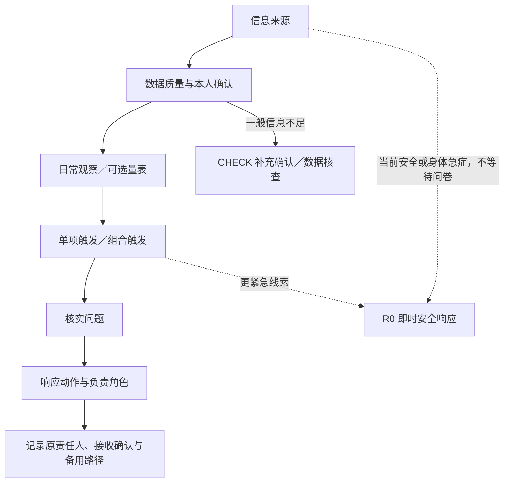
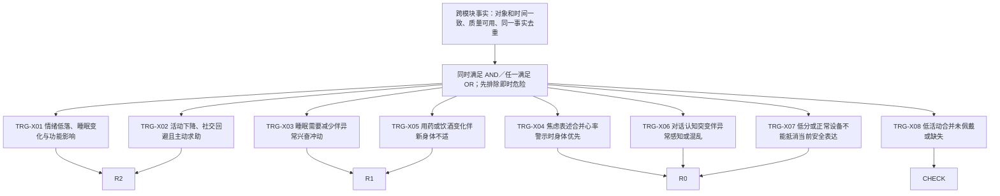

# 同频 B2｜七模块采集、量表与响应流程 V0.3

日期：2026-09-09。虚构案例／规则设计演示；不是临床施测表、自动诊断或真实转诊服务。

## 阅读方式与目录

本文件含九张 Mermaid 图：图 01 总览，图 02–08 七模块，图 09 跨模块组合。支持 Mermaid 的编辑器可直接渲染；无需渲染时，每张图下方的表和规则仍可阅读。互动版 HTML 可离线展开同一内容。

1. 总览与统一响应出口
2. 七模块流程与采集矩阵
3. 组合触发图
4. 五类规则完整清单（K/Q/D/X 与公共 G）
5. 量表结构
6. 十个虚构案例
7. 来源与版本

## 规则速查表

| 编号与名称 | 模块 | 响应与启用状态 |
| --- | --- | --- |
| TRG-EMO-K01｜普通情绪陪伴 | EMO | R3；可用于演示 |
| TRG-EMO-K02｜持续困扰伴功能影响 | EMO、SOC | R2；候选规则，须专业评审 |
| TRG-EMO-Q01｜成人短筛需进一步评估 | EMO | R2；候选规则，中文版本待核验 |
| TRG-EMO-Q02｜成人长表候选切点 | EMO | R2；候选规则，须专业评审 |
| TRG-SLP-K01｜单晚睡眠线索 | SLP | CHECK；可用于演示 |
| TRG-SLP-K02｜睡少但不困需澄清 | SLP、ACT | CHECK；候选规则，须专业评审 |
| TRG-SLP-D01｜睡眠设备趋势问候 | SLP | CHECK；演示配置 未启用，未经临床分诊验证 |
| TRG-ACT-K01｜低精力日常支持 | ACT | R3；可用于演示 |
| TRG-ACT-D01｜步数趋势关怀 | ACT | CHECK；演示配置 未启用，未经临床分诊验证 |
| TRG-ACT-D02｜活动数据不可用 | ACT | CHECK；可用于演示 |
| TRG-COG-K01｜突发混乱或言语不连贯 | COG、SAF | R0；安全候选规则，须本地协议确认 |
| TRG-COG-K02｜新发异常感知 | COG | R1；候选规则，须专业评审 |
| TRG-COG-K03｜引用或虚构语境 | COG、SAF | CHECK；可用于演示 |
| TRG-SOC-K01｜社交回避伴功能影响 | SOC | R2；候选规则，须专业评审 |
| TRG-SOC-K02｜本人主动请求专业帮助 | SOC | R2；可用于演示 |
| TRG-SOC-K03｜普通陪伴或换人需要 | SOC | R3；可用于演示 |
| TRG-BOD-K01｜心率或心悸情境补充 | BOD | CHECK；候选规则，须医学评审 |
| TRG-BOD-K02｜心悸伴身体警示症状 | BOD、SAF | R0；安全候选规则，须本地协议确认 |
| TRG-BOD-K03｜胸部疼痛或不适的独立急症入口 | BOD、SAF | R0；安全候选规则，须本地协议确认 |
| TRG-BOD-D01｜孤立心率读数不作精神分诊 | BOD | CHECK；可用于演示 |
| TRG-SAF-K01｜明确当前本人安全线索 | SAF | R0；安全候选规则，须本地机构审批 |
| TRG-SAF-Q01｜PHQ-9 第 9 题独立核查 | SAF、EMO | R1；候选规则，中文版本待核验 |
| TRG-SAF-K02｜现实第三方安全线索 | SAF、SOC | R1；安全候选规则，须本地机构审批 |
| TRG-SAF-K03｜否定、历史或含糊安全语义 | SAF | CHECK；候选规则，须专业评审 |
| TRG-SAF-K04｜已发生伤害或过量 | SAF、BOD | R0；安全候选规则，须本地机构审批 |
| TRG-X01｜情绪低落、睡眠变化与功能影响 | EMO、SLP、SOC | R2；候选组合，须专业评审 |
| TRG-X02｜活动下降、社交回避且主动求助 | ACT、SOC | R2；候选组合，须专业评审 |
| TRG-X03｜睡眠需要减少伴异常兴奋冲动 | SLP、ACT、COG | R1；候选组合，须专业评审 |
| TRG-X04｜焦虑表述合并心率警示时身体优先 | EMO、BOD、SAF | R0；安全候选组合，须本地协议确认 |
| TRG-X05｜用药或饮酒变化伴新身体不适 | BOD、COG | R1；候选组合，须医学评审 |
| TRG-X06｜对话认知突变伴异常感知或混乱 | COG、SAF | R0；安全候选组合，须本地协议确认 |
| TRG-X07｜低分或正常设备不能抵消当前安全表达 | EMO、ACT、BOD、SAF | R0；安全候选组合，须本地机构审批 |
| TRG-X08｜低活动合并未佩戴或缺失 | ACT | CHECK；可用于演示 |
| TRG-G01｜缺失、不确定与年龄权限守则 | EMO、SLP、ACT、COG、SOC、BOD、SAF | CHECK；可用于演示 |
| TRG-G02｜专业求助未接收守则 | SOC、SAF | R2；可用于演示；真实 SLA 与合作待建立 |

条件、排除项和责任人的完整定义见下方同编号规则。速查表不替代安全旁路或专业核实。

## 图 01｜总览

CHECK 是补充确认／数据核查，不是疾病分级。R0–R3 是服务响应路径，不是对未来自伤的预测性等级。优先处理当前 R0，再处理 R1；一般信息不全走 CHECK，信息充分时根据需要选择 R2 或 R3。多条规则命中不累计为总风险分。

### CHECK｜信息补充

响应：核对对象、当前或历史、来源、授权、数据质量和必要症状；保持缺失或不确定，不补零、不诊断、不把未回复当安全。

角色：用户端负责确认或跳过；志愿者端只看获授权摘要并可协助澄清；管理端只维护队列、权限和数据质量；需要临床判断时交专业人员。

接续：这不是疾病或安全分层。尚未获得接收确认时不得写已接管；任何明确当前安全或身体急症线索立即旁路到 R0/R1。

### R3｜日常陪伴

响应：提供可跳过的倾听、日记、休息或自愿练习；保留‘找人帮助’入口，不写无风险或已排除疾病。

角色：用户端选择需要；小频提供边界清楚的陪伴；志愿者端按资格与容量承接普通请求；管理端不默认查看全文。

接续：本人可随时请求 R2；出现 R0/R1 事实立即升级。普通请求尚未被真人接收时显示等待，不承诺持续值守。

### R2｜进一步专业评估与计划性支持

响应：基于筛查结果、持续困扰、功能影响或本人意愿，提供专业评估、就诊建议或已有治疗团队接续；分数不独立决定去向。

角色：用户确认意愿；志愿者可整理必要摘要并继续已承诺支持；管理端协调资源；专业人员决定评估与后续计划。

接续：发送申请、点击电话或管理端收件都不是已接收。具名人员或机构记录确认和时间后才更新；无人接收时保留原责任与备用路径，不承诺未建立的 SLA。

### R1｜当次紧急专业评估

响应：在当前互动中启动专业安全或紧急评估，核实当前性、已发生事实和所需支持；有即时危险或身体急症则进入 R0。

角色：用户端显示当前状态与现实求助；普通志愿者可倾听和连接但不独立作临床评估；管理端协调备援；受训专业人员完成核查。

接续：未有真实接收确认时继续显示待接收、原责任人、备用专业路径和现实渠道；不以固定秒数承诺响应。

### R0｜即时安全响应

响应：停止非必要问卷、跟练和运动提醒；突出适用的现实医疗急救 120、迫近公共安全危险 110、专业协同及在安全情况下联系可信支持者。

角色：用户端立即展示现实选择；在场人员按现实情况求助；专业人员依本地机构协议接续；模型不自动报警、定位、通知家属或决定住院。

接续：不等待量表、确认、复测、普通名额或 App 人工接单。只有具名接收及可核验依据后才显示已接手；热线不能替代急救，也不承诺同频具备真实救援能力。

## 图 02–08｜七模块

### EMO｜情绪体验

记录本人当前和近期的主要感受、困扰程度、兴趣变化及希望获得的支持，不把标签相加成诊断或风险总分。

图 02｜情绪体验

| 环节 | 内容 |
| --- | --- |
| 信息来源 | 晨间或晚间由本人点选、文字输入（本人确认后有效）；本轮获授权的语音转写（原文可纠正，确认后有效）；本人主动分享且仍在授权范围内的日记片段（未分享或撤回则不可见）；正式量表中由本人逐题确认的结果（未确认、拒答或缺题保留为缺失） |
| 数据质量与确认 | 区分现在、过去两周和更早历史；区分本人、第三方、引用与假设；缺失不等于没有；量表答案须由本人针对正式题目确认 |
| 日常观察字段 | 本人情绪标签；困扰程度 0–10；所指时间窗；兴趣或愉悦变化；是否希望找人；确认状态 |
| 可选工具 | DAILY、PHQ2、PHQ9、GAD2、GAD7 |
| 关键词示例 | 低落、难过、焦虑、绝望、提不起兴趣、想找人聊聊 |
| 单项与组合规则 | TRG-EMO-K01、TRG-EMO-K02、TRG-EMO-Q01、TRG-EMO-Q02、TRG-SAF-Q01、TRG-X01、TRG-X04、TRG-X07、TRG-G01 |
| 核实问题 | 现在最明显的感受是什么？；这份感受影响日常事情了吗？；你希望我陪你聊聊、记下来，还是帮你找真人支持？ |
| 响应与责任 | 按命中规则选择 CHECK / R0–R3；用户确认、志愿者倾听连接、管理者协调、专业人员评估；接收前不释放原责任。 |
| 边界 | 日常情绪记录不是正式量表；总分不能预测未来自伤，也不能拦截本人主动求助。 |

### SLP｜睡眠与节律

分别记录本人感受、睡眠事件和设备估计，关注睡少后是否困倦或感觉不需要睡。

图 03｜睡眠与节律

| 环节 | 内容 |
| --- | --- |
| 信息来源 | 晨间由本人点选、文字输入或获授权语音自述；本人手填并确认的入睡、醒来和估计时长；获授权设备的睡眠估计（须附设备来源、佩戴与质量；未授权、未佩戴或离线则为缺失）；本人主动分享且仍在授权范围内的日记片段 |
| 数据质量与确认 | 跨午夜按一次睡眠事件；卧床时长不等于睡眠；设备值不覆盖自述；昨晚线索不扩展为过去两周量表答案 |
| 日常观察字段 | 入睡与醒来时间；本人估计睡眠时长；设备估计与来源；夜醒或早醒；恢复感；睡少后困倦或不需要睡 |
| 可选工具 | DAILY、PHQ9 |
| 关键词示例 | 睡不着、早醒、整夜没睡、睡得少也不困、不需要睡、昼夜颠倒 |
| 单项与组合规则 | TRG-SLP-K01、TRG-SLP-K02、TRG-SLP-D01、TRG-X01、TRG-X03、TRG-G01 |
| 核实问题 | 昨晚休息得怎么样？；睡少之后是困倦，还是觉得自己不需要睡？；这和你平常的作息相比有什么变化？ |
| 响应与责任 | 按命中规则选择 CHECK / R0–R3；用户确认、志愿者倾听连接、管理者协调、专业人员评估；接收前不释放原责任。 |
| 边界 | 不新增睡眠专项量表；单晚睡眠或设备静止不能诊断失眠、抑郁或躁狂。 |

### ACT｜精力与活动

记录本人精力、活动情境和经授权设备趋势，用于发起低压力关怀。

图 04｜精力与活动

| 环节 | 内容 |
| --- | --- |
| 信息来源 | 晨间或晚间由本人点选、文字输入或获授权语音自述的精力与活动情境；本人手填并确认的活动记录；获授权设备的步数或活动分钟（须附来源、单位、时间、佩戴与质量；未授权、未佩戴或离线则为缺失）；本人主动分享且仍在授权范围内的日记片段 |
| 数据质量与确认 | 缺失与零值分开；未佩戴不等于不活动；参考值按同类日且需足够有效数据；行动障碍、轮班、休息和恢复情境必须澄清 |
| 日常观察字段 | 精力 0–10；步数或活动分钟；采集时间与单位；佩戴与清醒状态；个人参考值；本人活动意愿 |
| 可选工具 | DAILY、PHQ9 |
| 关键词示例 | 没力气、不想动、一直坐着、今天走得少、在休息、没戴手表 |
| 单项与组合规则 | TRG-SLP-K02、TRG-ACT-K01、TRG-ACT-D01、TRG-ACT-D02、TRG-X02、TRG-X03、TRG-X07、TRG-X08、TRG-G01 |
| 核实问题 | 今天的精力大约是多少？；这段时间活动少，是休息、学习工作、身体不适，还是提不起劲？；如果你愿意，现在更想聊聊还是暂缓提醒？ |
| 响应与责任 | 按命中规则选择 CHECK / R0–R3；用户确认、志愿者倾听连接、管理者协调、专业人员评估；接收前不释放原责任。 |
| 边界 | 活动趋势只触发情境确认，不判精神疾病发作，不强推运动，也不降低无设备用户的求助资格。 |

### COG｜对话与认知

从获授权对话中标注对象、否定、引用、时间和突发认知变化，保留原句与不确定性。

图 05｜对话与认知

| 环节 | 内容 |
| --- | --- |
| 信息来源 | 当前对话中由本人输入并允许处理的原句；本轮获授权的语音转写（听不清片段保持不确定，确认后才成为有效记录）；本人主动分享且仍在授权范围内的日记片段；具备权限的人工核实记录（须标明核实人、时间与依据） |
| 数据质量与确认 | 电视声和旁人声不当作本人回答；引用、假设和现实陈述分开；转写不清不补写；突发混乱不归因于情绪 |
| 日常观察字段 | 本人原句；说话对象；否定或引用标记；事件时间；转写置信与听不清片段；定向和表达变化 |
| 可选工具 | DAILY |
| 关键词示例 | 听到别人听不到的声音、看到不存在的东西、突然糊涂、说不清在哪里、电影里说、如果有人 |
| 单项与组合规则 | TRG-COG-K01、TRG-COG-K02、TRG-COG-K03、TRG-X03、TRG-X05、TRG-X06、TRG-G01 |
| 核实问题 | 这句话说的是你现在的情况、过去的事，还是引用别人的话？；你现在知道自己在哪里、正在做什么吗？；这些体验是新出现的，还是以前也有？ |
| 响应与责任 | 按命中规则选择 CHECK / R0–R3；用户确认、志愿者倾听连接、管理者协调、专业人员评估；接收前不释放原责任。 |
| 边界 | 语气、语速、哭声、口音或模型置信度不直接生成疾病标签或量表答案。 |

### SOC｜社交与功能

分项记录学习工作、自理、社交影响以及本人明确提出的支持需要。

图 06｜社交与功能

| 环节 | 内容 |
| --- | --- |
| 信息来源 | 晚间或当前由本人点选、文字输入或获授权语音自述的功能分项；本人主动提出的陪伴、换人或专业支持请求；本人主动分享且仍在授权范围内的日记片段；获授权服务工单与人工交接记录（未接收时明确显示待接收） |
| 数据质量与确认 | 功能分项是产品自评而非验证量表；本人希望获得专业帮助可独立触发；沉默或迟回不等于社交退缩；服务结束不等于需要消失 |
| 日常观察字段 | 学习或工作影响 0–3；自理影响 0–3；社交影响 0–3；回避变化；本人支持偏好；当前责任人 |
| 可选工具 | DAILY |
| 关键词示例 | 不想见人、上不了班、没法上课、照顾不了自己、需要帮助、想换个人聊 |
| 单项与组合规则 | TRG-EMO-K02、TRG-SOC-K01、TRG-SOC-K02、TRG-SOC-K03、TRG-SAF-K02、TRG-X01、TRG-X02、TRG-G01、TRG-G02 |
| 核实问题 | 今天学习或工作、自理、与人相处分别受到多大影响？；你希望获得陪伴、专业评估还是其他现实帮助？；现在是否已经有人负责跟进？ |
| 响应与责任 | 按命中规则选择 CHECK / R0–R3；用户确认、志愿者倾听连接、管理者协调、专业人员评估；接收前不释放原责任。 |
| 边界 | 功能困难和求助意愿影响服务安排，但不等于诊断或未来风险等级。 |

### BOD｜身体与生活

记录身体不适、心率测量情境、用药或饮酒变化，优先识别需现实医疗帮助的警示症状。

图 07｜身体与生活

| 环节 | 内容 |
| --- | --- |
| 信息来源 | 本人点选、文字输入或获授权语音自述的身体与生活变化；本人手填并确认的测量值、时间和情境；获授权设备的心率或 HRV 记录（须附设备来源、单位、时间、佩戴与质量；未授权、未佩戴或离线则为缺失）；本人主动分享且仍在授权范围内的日记片段；血压、血氧、体温为未启用扩展，本版不采集、不推断 |
| 数据质量与确认 | 人体数值注明为虚构演示、本人手填或真实设备来源；运动后读数与静息读数分开；单次心率或 HRV 不解释精神状态；食欲、体重、疼痛、用药和饮酒以本人自述及明确来源呈现，不自动拟诊或调药；血压、血氧、体温当前未启用，不用其他数据补造；不因焦虑表述排除身体急症 |
| 日常观察字段 | 心率与单位；HRV 及单位（仅记录，不设精神疾病阈值）；测量时间和活动背景；心悸是否持续；胸痛、呼吸困难、头晕或晕厥；食欲变化（本人自述）；体重、来源与测量时间（可选）；疼痛部位与感受（本人自述）；用药与饮酒变化（本人自述）；咖啡因变化（本人自述）；血压、血氧、体温（未启用扩展） |
| 可选工具 | DAILY |
| 关键词示例 | 心慌、心悸、胸痛、喘不上气、快晕了、咖啡、漏药、喝酒变多 |
| 单项与组合规则 | TRG-BOD-K01、TRG-BOD-K02、TRG-BOD-K03、TRG-BOD-D01、TRG-SAF-K04、TRG-X04、TRG-X05、TRG-X07、TRG-G01 |
| 核实问题 | 这个读数是在休息时还是活动后测到的？；心悸现在还在吗，是否同时胸痛、呼吸困难、头晕或将要晕厥？；最近用药、咖啡因或饮酒有没有变化？ |
| 响应与责任 | 按命中规则选择 CHECK / R0–R3；用户确认、志愿者倾听连接、管理者协调、专业人员评估；接收前不释放原责任。 |
| 边界 | 不建立 HRV 精神疾病阈值，不根据心率正常排除急症，不提供自动调药建议；血压、血氧、体温仅为未启用扩展，不在本版规则或案例中使用。 |

### SAF｜风险信息

独立处理本人或第三方的当前伤害与自杀线索，明确当前肯定表达直接进入安全响应。

图 08｜风险信息

| 环节 | 内容 |
| --- | --- |
| 信息来源 | 当前对话中由本人明确输入的安全相关原句（明确当前肯定表达不等待后续确认）；本轮获授权语音中待核实的安全片段（保留原文、对象、时点和转写不确定性）；正式 PHQ-9 第 9 题由本人确认的有效回答；现实第三方安全线索（与本人量表分开记录）；安全响应启动后，由获授权专业人员核实的计划有无、相关手段或工具可及性、近期行为和当前支持（不作为进入 R0 的前置门槛，不索取操作细节）；具备权限的人工核实、已采取动作与真实接收记录（未接收不得写已接管） |
| 数据质量与确认 | 明确当前肯定不等待确认或量表；第 9 题非零单独核查；低分和正常设备不能抵消；新否定不静默删除既有事件；未回复不判安全 |
| 日常观察字段 | 本人或第三方；当前、近期或历史；明确肯定、否定或不确定；本人当前报告的伤害命令声音；已发生或近期相关行为；安全响应启动后的计划有无（不索取操作细节）；安全响应启动后的相关手段或工具可及性（不索取操作细节）；当前现实支持与是否有人可协助；是否有即时身体急症；人工核实和接收状态 |
| 可选工具 | PHQ9、ASQ |
| 关键词示例 | 现在想死、想结束生命、正在伤害自己、不想活了、想伤害别人、只是台词、以前想过 |
| 单项与组合规则 | TRG-COG-K01、TRG-COG-K03、TRG-BOD-K02、TRG-BOD-K03、TRG-SAF-K01、TRG-SAF-Q01、TRG-SAF-K02、TRG-SAF-K03、TRG-SAF-K04、TRG-X04、TRG-X06、TRG-X07、TRG-G01、TRG-G02 |
| 核实问题 | 这说的是你本人还是其他人？；这是现在正在发生、近期发生，还是更早的历史？；是否存在正在发生的伤害或需要立即医疗帮助的情况？；安全响应启动后，由获授权专业人员核实：现在是否存在相关计划？仅确认有无，不询问操作细节。；安全响应启动后，由获授权专业人员核实：现在是否可接触到相关手段或工具？仅确认可及性，不索取操作细节。；安全响应启动后，由获授权专业人员核实：近期是否已有相关行为，以及当前是否有现实支持可协助？ |
| 响应与责任 | 按命中规则选择 CHECK / R0–R3；用户确认、志愿者倾听连接、管理者协调、专业人员评估；接收前不释放原责任。 |
| 边界 | 本模块不是预测引擎；模型不自动报警、定位或通知家属，现实联络须由适用协议、权限与合法依据支持。 |

## 图 09｜跨模块组合

AND 表示同时满足，OR 表示任一满足；具体阈值、排除项、适用年龄和动作以以下同编号完整规则为准。当前紧急安全信号不受一般数据核查阻挡。

## 规则完整清单

### 关键词与语义规则

TRG-EMO-K01｜普通情绪陪伴

适用模块：情绪体验

条件：本人描述当前短暂低落、紧张、疲惫或轻微烦躁 AND 未报告明显功能影响 AND 未提出专业帮助 AND 无当前安全或身体急症线索。

排除项：排除第三方、引用、历史事件；排除任何当前伤害表达、胸痛、呼吸困难、晕厥或突发混乱。

核实问题与方法：确认是本人当前感受，以及希望聊聊、记录、练习还是休息。

响应出口：R3

责任人：用户端发起；小频提供可跳过的日常陪伴，用户可随时改选真人支持。

启用状态：可用于演示

示例：今天有点烦，工作还能做，想和小频说两句。

反例：我现在想结束生命。

依据及用途：[S1]

TRG-EMO-K02｜持续困扰伴功能影响

适用模块：情绪体验、社交与功能

条件：本人报告情绪困扰持续或反复 AND 学习工作、自理或社交至少一项受到明确影响 AND 无更紧急安全或身体急症线索。

排除项：单日轻微波动且功能未受影响；未回复；只说第三方。

核实问题与方法：分别核对持续时间、功能分项和本人希望的支持，不用“严重”作为执行条件。

响应出口：R2

责任人：志愿者可协助整理；专业人员评估支持计划，接收前保留当前责任。

启用状态：候选规则，须专业评审

示例：这两周一直低落，已经多次没法去上班，希望找专业人员。

反例：今天有点难过，但日常事情都能做。

依据及用途：[S1]

TRG-SLP-K01｜单晚睡眠线索

适用模块：睡眠与节律

条件：本人仅描述昨晚入睡困难、夜醒、早醒或恢复感差 AND 尚未说明过去两周频率和功能影响 AND 无安全或急症线索。

排除项：不得直接写入 PHQ-9；排除睡少且不困伴异常兴奋冲动。

核实问题与方法：记录为昨晚的日常观察，并询问是否希望说明原因、身体不适或近期趋势。

响应出口：CHECK

责任人：用户端确认；小频只补充情境，不自动开启正式量表。

启用状态：可用于演示

示例：昨晚一直没睡好。

反例：过去两周几乎每天都睡不好，并已针对正式题目确认选项。

依据及用途：产品设计守则；无临床阈值依据，不代表经过临床验证

TRG-SLP-K02｜睡少但不困需澄清

适用模块：睡眠与节律、精力与活动

条件：本人报告睡眠明显少于自己的平常水平 AND 同时表示不困或不需要睡 AND 尚未确认异常兴奋、冲动或失控行为。

排除项：仅一晚因工作少睡且次日困倦；设备估计但本人否认。

核实问题与方法：询问持续时间、是否异常兴奋或冲动、功能变化及用药或物质变化。

响应出口：CHECK

责任人：小频补充信息；出现组合证据后由专业人员接续。

启用状态：候选规则，须专业评审

示例：这两晚只睡三四小时但一点不困，还没说明其他变化。

反例：这两晚不需要睡、异常兴奋并冲动消费。

依据及用途：[S6]

TRG-ACT-K01｜低精力日常支持

适用模块：精力与活动

条件：本人报告今天精力低或提不起劲 AND 未报告明确功能中断、身体警示或安全线索 AND 愿意接受普通陪伴。

排除项：仅设备步数低；未回复；胸痛、晕厥、突发混乱或当前伤害表达。

核实问题与方法：询问身体是否不适，以及更想休息、聊聊、记录还是找人。

响应出口：R3

责任人：用户端选择；小频不强推活动，志愿者按需陪伴。

启用状态：可用于演示

示例：今天没什么精神，想先坐着聊一会儿。

反例：今天没精神并且胸痛、快晕了。

依据及用途：产品设计守则；无临床阈值依据，不代表经过临床验证

TRG-COG-K01｜突发混乱或言语不连贯

适用模块：对话与认知、风险信息

条件：本人或现实在场者报告突发的现实症状 AND（症状当前正在持续 OR 尚未确认已经恢复）AND（出现混乱、不能辨认地点或人物、对话突然不合逻辑 OR 说话明显无法表达连贯意思）。

排除项：仅有既往历史且已确认恢复；稳定的口音、输入法错误、普通语音转写失败；不能仅凭模型输出、风格或自动推断判断症状存在。

核实问题与方法：只做简短现实核实；当前持续或尚未确认恢复时不延迟现实急症求助，不让用户独自驾车就医。历史发作虽已恢复，也提示尽快寻求现实医疗评估，不自动标成平稳。

响应出口：R0

责任人：用户端突出 120 等现实医疗急救；专业人员按机构流程协同，普通志愿者不独立判断病因。

启用状态：安全候选规则，须本地协议确认

示例：现实在场家人说他刚刚突然认不出家里，也说不成完整句子，目前仍在持续。

反例：本人说去年曾短暂混乱但已恢复；不套当前 R0，仍提示尽快寻求现实医疗评估。

依据及用途：[S7]

TRG-COG-K02｜新发异常感知

适用模块：对话与认知

条件：本人确认新近出现听到、看到、闻到、尝到或感觉到他人未感知内容 AND 无突发混乱、快速加重、伤害指令或即时危险。

排除项：入睡或将醒时短暂体验尚待澄清；电影、梦境、比喻或第三方转述。

核实问题与方法：核对是否新发、是否快速变化、药物或物质情境和当前安全；不诊断原因。

响应出口：R1

责任人：当次协调专业评估；未接收时保留当前责任并展示备用现实路径。

启用状态：候选规则，须专业评审

示例：最近第一次听到别人听不到的声音，目前没有伤害指令，也没有突然糊涂。

反例：电影里演员说自己听到声音。

依据及用途：[S7]

TRG-COG-K03｜引用或虚构语境

适用模块：对话与认知、风险信息

条件：文本明确标记为电影、书籍、歌曲、转述练习或假设中的台词 AND 没有证据表明是本人当前想法或真实第三方当前事件。

排除项：‘朋友现在想死’是现实第三方线索，不属于引用；引用后又说‘我也是’须按本人表达处理。

核实问题与方法：仅在语境仍不清时问一句对象与现实性；不填写本人量表。

响应出口：CHECK

责任人：小频保留语境标记；用户可纠正，志愿者看到的摘要不得改写为本人安全阳性。

启用状态：可用于演示

示例：刚才那句‘不想活了’是电影台词，我在讨论剧情。

反例：我朋友现在说他不想活了，我不知道怎么办。

依据及用途：[S9]

TRG-SOC-K01｜社交回避伴功能影响

适用模块：社交与功能

条件：本人报告相较平常持续回避联系或见人 AND 学习工作、自理或社交功能至少一项明确受影响 AND 无更紧急线索。

排除项：主动独处休息且功能未受影响；迟回消息或关闭通知。

核实问题与方法：确认变化时长、功能分项及希望获得何种支持。

响应出口：R2

责任人：志愿者可陪伴并整理需求；专业人员评估后续计划。

启用状态：候选规则，须专业评审

示例：这两周一直躲着同事，已经无法到岗。

反例：周末想独处半天，工作和自理没有受影响。

依据及用途：[S1]

TRG-SOC-K02｜本人主动请求专业帮助

适用模块：社交与功能

条件：本人明确提出希望专业人员评估、希望就诊建议或希望联系已有治疗团队 AND 无当前 R0 或 R1 线索。

排除项：仅询问产品功能；第三方泛泛咨询。

核实问题与方法：询问希望的支持类型、地区和已有团队；量表低分或无设备不作为拒绝理由。

响应出口：R2

责任人：志愿者或小频协助发起；专业接收前原责任不释放，公开资源不等于预约。

启用状态：可用于演示

示例：即使分数不高，我也想找专业人员谈谈。

反例：我想知道哪里能设置提醒。

依据及用途：[S1]

TRG-SOC-K03｜普通陪伴或换人需要

适用模块：社交与功能

条件：本人希望找真人倾听或更换当前陪伴者 AND 未提出专业评估 AND 无紧急安全或身体急症线索。

排除项：普通队列满额不能拦截 R0/R1；不能把找人聊天自动解释为临床转诊。

核实问题与方法：确认普通陪伴、换人或专业帮助的区别，并显示当前等待与责任状态。

响应出口：R3

责任人：志愿者端按资格和容量承接；管理端只协调，不默认查看全文。

启用状态：可用于演示

示例：我想换一位志愿者继续聊。

反例：我现在正在伤害自己，需要马上帮助。

依据及用途：产品设计守则；无临床阈值依据，不代表经过临床验证

TRG-BOD-K01｜心率或心悸情境补充

适用模块：身体与生活

条件：本人报告活动后心率上升或短暂心悸 AND 当前已经缓解 AND 明确没有胸痛、呼吸困难、将要晕厥或已晕厥。

排除项：任何当前警示症状；不能因本人说焦虑就默认是惊恐。

核实问题与方法：记录测量来源、活动背景、是否持续，以及咖啡因、饮酒和用药变化；反复或担心时建议现实医疗咨询。

响应出口：CHECK

责任人：用户端补充；小频不诊断，必要时提示联系现实医疗人员。

启用状态：候选规则，须医学评审

示例：爬楼后手表显示心率上升，喝过咖啡，现在已缓解且无胸痛、气短或晕厥感。

反例：现在心悸不缓解并伴胸痛和快要晕倒。

依据及用途：[S13] [S14]

TRG-BOD-K02｜心悸伴身体警示症状

适用模块：身体与生活、风险信息

条件：本人当前有心悸 AND（心悸持续不退 OR 同时存在胸痛、呼吸困难、将要晕厥或已经晕厥中的任一项）。

排除项：不要求心悸持续与警示症状同时满足；不等待心理量表、心率复测或焦虑解释；不能仅靠正常设备读数排除。

核实问题与方法：只核对是否当前存在警示症状和所在地区可用的急救方式，不延迟求助。

响应出口：R0

责任人：用户端突出 120 等现实医疗急救；专业人员按本地协议协同，普通志愿者不单独处置。

启用状态：安全候选规则，须本地协议确认

示例：现在心悸没有停，还胸痛并觉得要晕过去。

反例：运动后短暂心跳快，已经缓解且没有警示症状。

依据及用途：[S13] [S14]

TRG-BOD-K03｜胸部疼痛或不适的独立急症入口

适用模块：身体与生活、风险信息

条件：（本人或现实在场者报告当前正在发生的胸部症状）AND（突发胸部疼痛或不适持续不退 OR 胸痛向左臂或右臂、颈部、下颌、腹部或背部放射 OR 胸痛同时伴出汗、恶心、头晕或呼吸困难中的任一项）。

排除项：仅有去年或更早历史且已确认恢复，不按当前 R0 命中；不以存在心悸、设备读数异常、焦虑表述或量表结果为前提；不得用正常心率排除。

核实问题与方法：只核对症状是否当前存在和所在地区可用的急救方式，不延迟现实医疗急救，不引导自行诊断。近期发作虽已缓解但当时出现上述警示时，仍提示现实医疗紧急咨询，不自动标成平稳。

响应出口：R0

责任人：用户端突出 120 等现实医疗急救；专业人员按本地协议协同，普通志愿者不单独判断原因。

启用状态：安全候选规则，须本地协议确认

示例：胸口突然出现压迫样不适且一直不退，即使没有心悸或设备读数也立即进入 R0。

反例：去年曾有胸痛并向手臂放射、目前早已恢复，不套当前 R0；近期已缓解但曾出现警示症状时仍需现实医疗紧急咨询，不能自动标成平稳。

依据及用途：[S15]

TRG-SAF-K01｜明确当前本人安全线索

适用模块：风险信息

条件：本人明确肯定现在有自杀或结束生命想法 OR 本人现在正在伤害自己 OR 本人明确现在要伤害他人 OR 本人明确报告当前听到命令自己伤害自己或他人的声音。

排除项：电影、书籍、梦境、练习台词或转述且非本人当前现实体验不命中；不要求同时具备计划、工具和时间；不等待转写确认、量表完成、复测或普通志愿者名额。

核实问题与方法：立即启动安全响应；随后由获授权专业人员核实计划有无、相关手段或工具可及性、近期行为和当前现实支持，这些核实不是进入 R0 的前置门槛，且不索取操作细节。

响应出口：R0

责任人：用户端停止非必要流程并突出现实渠道；专业人员接续，接收前原责任与备用路径保持可见。

启用状态：安全候选规则，须本地机构审批

示例：我现在听到声音命令我伤害自己。

反例：电影角色说‘我不想活了’，我在讨论剧情。

依据及用途：[S1] [S5] [S7] [S12]

TRG-SAF-K02｜现实第三方安全线索

适用模块：风险信息、社交与功能

条件：用户报告一个可识别情境中的朋友、家人或其他第三方当前表达想死、自伤或伤人 AND 不是虚构、引用或假设。

排除项：不得填入用户本人的 PHQ 或 GAD；电影、书籍或练习台词不命中。

核实问题与方法：核对第三方是否正处于即时危险、用户是否与其在一起，以及可用的当地现实求助；不要求用户承担专业处置。

响应出口：R1

责任人：专业人员为用户提供针对第三方的安全指导；即时危险时提示联系当地急救或公共安全渠道。

启用状态：安全候选规则，须本地机构审批

示例：我朋友现在发消息说他不想活了，我联系不上他。

反例：电影里的朋友角色说不想活了。

依据及用途：[S5] [S12]

TRG-SAF-K03｜否定、历史或含糊安全语义

适用模块：风险信息

条件：表达包含死亡或伤害相关词 AND（明确为过去历史 OR 明确否认本人当前相关想法或行为 OR 对象与时间不清）AND 没有明确当前肯定证据。

排除项：‘不想活了’本身是死亡意愿表达，不是安全否认；既有安全事件不能被一句新否定静默清除或自动结案；明确当前本人或现实第三方表达走更高路径。

核实问题与方法：中性核对对象、当前或历史、否定范围；允许不确定和拒答，未回复不判安全。

响应出口：CHECK

责任人：小频或志愿者补充信息；必要时交专业人员，不自动写量表答案。

启用状态：候选规则，须专业评审

示例：我不是想死，只是太累；此前没有既有安全事件。

反例：我现在不想活了。

依据及用途：[S1] [S5] [S9]

TRG-SAF-K04｜已发生伤害或过量

适用模块：风险信息、身体与生活

条件：本人或在场者报告正在发生的自伤、服药过量、中毒或其他已发生身体伤害。

排除项：不等待量表、症状积分、聊天总结或远程志愿者接单。

核实问题与方法：只获取现实急救所需的最少信息，不提供自行催吐、调药或替代急救的建议。

响应出口：R0

责任人：用户端突出 120；具备权限的专业人员按协议协同，信息披露须有适用依据和审计。

启用状态：安全候选规则，须本地机构审批

示例：我刚刚吞了很多药。

反例：医生按计划调整了药物，当前没有不适。

依据及用途：[S5] [S12]

### 量表规则

TRG-EMO-Q01｜成人短筛需进一步评估

适用模块：情绪体验

条件：年龄为成人 AND PHQ-2 或 GAD-2 全部题目有效且本人确认 AND 任一总分 ≥3 AND 无更高优先级线索。

排除项：未成年人；缺题；未确认；由闲聊推算；当前安全或身体急症。

核实问题与方法：展示量表、版本、过去两周时间窗、逐题答案和固定计分结果。

响应出口：R2

责任人：用户确认，固定程序计分；专业人员决定是否补长表或访谈。

启用状态：候选规则，中文版本待核验

示例：成人本人确认 GAD-2 两题总分为 3，当前无安全线索。

反例：根据昨晚聊天猜测 GAD-2 为 3。

依据及用途：[S2] [S3] [S1]

TRG-EMO-Q02｜成人长表候选切点

适用模块：情绪体验

条件：年龄为成人 AND（（PHQ-9 全部九题有效且本人确认 AND PHQ-9 总分 ≥10）OR（GAD-7 全部七题有效且本人确认 AND GAD-7 演示候选总分 ≥10））AND 无更高优先级线索。

排除项：PHQ-9 第 9 题非零；缺题或未确认；未成年人；明确当前安全或身体急症。

核实问题与方法：记录分项、功能和本人意愿；提示 GAD-7 的 10 分仅为演示候选且存在其他参考切点。

响应出口：R2

责任人：固定程序计分；专业人员结合功能、变化和本人意愿评估。

启用状态：候选规则，须专业评审

示例：成人本人确认 PHQ-9 九题总分 11，第 9 题为 0。

反例：PHQ-9 只答了八题，系统按缺题补零得到 11。

依据及用途：[S4] [S11] [S1]

TRG-SAF-Q01｜PHQ-9 第 9 题独立核查

适用模块：风险信息、情绪体验

条件：成人本人针对核验版 PHQ-9 第 9 题给出任何非零有效回答 AND 已确认该答案 AND 当前是否紧急尚未确定。

排除项：第 9 题为 0；缺失或未确认；由闲聊、第三方或引用推算；明确当前想法直接走 R0。

核实问题与方法：当次由有能力人员核实当前性和安全需要，总分低也不取消。

响应出口：R1

责任人：固定程序识别单题；专业人员当次核查，普通志愿者可协助连接但不独立评估。

启用状态：候选规则，中文版本待核验

示例：PHQ-9 总分 1，但第 9 题本人确认选择了非零选项。

反例：第 9 题未回答，系统补成 1。

依据及用途：[S4] [S1]

### 身体与行为数据规则

TRG-SLP-D01｜睡眠设备趋势问候

适用模块：睡眠与节律

条件：演示配置 未启用：已授权 AND 设备质量通过 AND 前 14 天至少 7 个有效日形成同类日参考 AND 连续 2 晚睡眠估计比个人参考少约 2 小时。

排除项：未佩戴、来源混杂、设备更换、基线不足、轮班情境未分组或用户关闭提醒。

核实问题与方法：先说明设备来源，再询问本人感受、轮班或其他情境；设备不覆盖自述。

响应出口：CHECK

责任人：用户端确认；管理端仅维护配置和审计，不据此调整支持标签。

启用状态：演示配置 未启用，未经临床分诊验证

示例：满足有效数据要求的两晚趋势仅生成一次‘和你的感觉接近吗’。

反例：手表一晚缺失就判定睡眠异常。

依据及用途：[S9]

TRG-ACT-D01｜步数趋势关怀

适用模块：精力与活动

条件：演示配置 未启用：已授权 AND 设备质量通过 AND 前 14 天至少 7 个有效日形成同类日参考 AND 连续 3 个有效日步数低于个人参考值 50%。

排除项：未佩戴、缺失、设备更换、基线为零、行动障碍、轮班或用户关闭提醒。

核实问题与方法：先问学习工作、休息、恢复、行动能力、身体不适或提不起劲，不默认原因。

响应出口：CHECK

责任人：用户端确认；管理端维护配置和数据质量，不能据此自动转诊。

启用状态：演示配置 未启用，未经临床分诊验证

示例：连续三天有效数据满足演示条件，仅邀请说明近况。

反例：一天显示 0 步就进入专业紧急响应。

依据及用途：[S9]

TRG-ACT-D02｜活动数据不可用

适用模块：精力与活动

条件：步数或活动分钟缺失、过期、来源不明 OR 用户明确未佩戴设备。

排除项：本人同时明确提出专业帮助或当前安全问题时不得停在信息补充。

核实问题与方法：标记不可用而不是零；可询问本人感受，但不反复要求设备权限。

响应出口：CHECK

责任人：小频标注质量；用户仍保留全部主动求助入口。

启用状态：可用于演示

示例：手表没戴，今天步数显示缺失。

反例：手表已确认全天佩戴且数据质量通过。

依据及用途：[S9]

TRG-BOD-D01｜孤立心率读数不作精神分诊

适用模块：身体与生活

条件：仅有一次设备心率数值或与个人参考的变化 AND 缺少可靠测量背景或本人症状信息。

排除项：本人已报告胸痛、呼吸困难、将要晕厥、已晕厥或突发混乱时必须进入更高优先级路径。

核实问题与方法：询问设备来源、时间、静息或活动背景及当前症状；不建立 HRV 或心率精神疾病阈值。

响应出口：CHECK

责任人：小频标注信息不足；用户可联系现实医疗人员，管理端不得用读数自动改支持标签。

启用状态：可用于演示

示例：手表单次显示 105 次/分，但不知道是否刚运动，也没有症状记录。

反例：心悸持续并伴胸痛和晕厥感。

依据及用途：[S13] [S14]

### 跨模块组合规则

TRG-X01｜情绪低落、睡眠变化与功能影响

适用模块：情绪体验、睡眠与节律、社交与功能

条件：本人当前或近期反复情绪低落或兴趣减少 AND 睡眠相较平常发生变化 AND 学习工作、自理或社交至少一项明确受影响 AND 无当前安全或身体急症。

排除项：只有一项线索；单晚设备估计；第三方或引用。

核实问题与方法：分别保留三项证据、各自时间窗和本人希望，不把日常记录换算成 PHQ 分数。

响应出口：R2

责任人：志愿者可整理事实；专业人员结合本人意愿评估支持计划。

启用状态：候选组合，须专业评审

示例：近两周心情低落、入睡明显变差，并多次无法上班。

反例：昨晚睡差，但今天情绪和功能都与平常一致。

依据及用途：[S1] [S4]

TRG-X02｜活动下降、社交回避且主动求助

适用模块：精力与活动、社交与功能

条件：本人确认活动相较平常下降 AND 同期回避社交或现实联系 AND 明确表示需要真人或专业帮助 AND 无更紧急线索。

排除项：仅设备低值、未佩戴、计划性休息或没有求助意愿。

核实问题与方法：核对活动来源、社交变化、功能和希望的支持类型。

响应出口：R2

责任人：志愿者协助连接；专业人员或适配服务确认接收前保留当前责任。

启用状态：候选组合，须专业评审

示例：最近几乎不出门也躲着朋友，我想找专业人员谈谈。

反例：手表没戴所以没有步数。

依据及用途：[S1]

TRG-X03｜睡眠需要减少伴异常兴奋冲动

适用模块：睡眠与节律、精力与活动、对话与认知

条件：本人报告睡眠需要明显少于自己的平常水平 AND 不困或精力异常高 AND 同期出现异常兴奋、明显失控或冲动行为中的至少一项。

排除项：普通熬夜后困倦；单纯开心；只由设备推断；未成年人须走单独专业路径而非成人规则。

核实问题与方法：核对持续时间、行为变化、用药或物质、当前安全和功能；不通过问卷自行诊断躁狂。

响应出口：R1

责任人：当次协调专业评估；如有即时危险升级 R0，未接收时保留原责任和备援。

启用状态：候选组合，须专业评审

示例：连续几晚只睡三小时却不困，异常兴奋并冲动消费。

反例：赶项目少睡一晚，第二天很困且没有行为变化。

依据及用途：[S6]

TRG-X04｜焦虑表述合并心率警示时身体优先

适用模块：情绪体验、身体与生活、风险信息

条件：本人同时报告焦虑或恐慌感 AND 当前心悸或心率异常感 AND 胸痛、呼吸困难、将要晕厥或已晕厥中的任一警示症状。

排除项：不得先按惊恐发作解释；不得以设备读数正常或量表低分排除急症。

核实问题与方法：只核对警示症状是否当前存在和现实急救方式，不延迟求助。

响应出口：R0

责任人：用户端突出 120 等医疗急救；专业人员按本地协议接续。

启用状态：安全候选组合，须本地协议确认

示例：我很焦虑、现在心慌，还胸痛并觉得快晕了。

反例：喝咖啡后短暂心跳快，已缓解且没有警示症状。

依据及用途：[S13] [S14]

TRG-X05｜用药或饮酒变化伴新身体不适

适用模块：身体与生活、对话与认知

条件：本人报告近期自行停药、漏服、改变处方用药或饮酒明显增加 AND 同期出现新的或加重的身体不适 AND 当前无 R0 警示症状。

排除项：仅按医嘱调整且无不适；心悸持续不退按 TRG-BOD-K02 进入 R0，即使没有胸痛也不能忽略；胸痛、呼吸困难、晕厥、过量、突发混乱或意识变化直接走 R0。

核实问题与方法：记录药物或饮酒变化和症状，不建议自行加减药；由现实医疗或专业人员评估。

响应出口：R1

责任人：当次协调专业或现实医疗评估；普通志愿者不提供药物建议。

启用状态：候选组合，须医学评审

示例：这周自行漏服几次药，又明显增加饮酒，现在只出现新的持续恶心，当前无 R0 警示症状。

反例：按医嘱服药，今天没有任何不适。

依据及用途：[S7] [S13] [S14]

TRG-X06｜对话认知突变伴异常感知或混乱

适用模块：对话与认知、风险信息

条件：对话中出现相较本人基线的突发定向或表达改变 AND 同时出现新发异常感知、突发混乱或快速恶化中的至少一项。

排除项：普通转写错误、口音、玩笑、引用、梦境；不能仅凭模型风格命中。

核实问题与方法：简短核实当前现实环境与警示事实，优先现实医疗评估。

响应出口：R0

责任人：用户端突出现实急救；专业人员按机构路径接续，未接收前不显示成功。

启用状态：安全候选组合，须本地协议确认

示例：对话中突然不认识地点、说话不连贯，并称刚开始看到不存在的人。

反例：语音转写有错字，但本人表达连贯且明确是电影情节。

依据及用途：[S7]

TRG-X07｜低分或正常设备不能抵消当前安全表达

适用模块：情绪体验、精力与活动、身体与生活、风险信息

条件：任一量表总分低、设备读数处于个人常见范围或活动正常 AND 本人同时明确肯定当前有自杀、伤害自己或即时伤人想法。

排除项：不得平均、抵消、降级或等待复测；明确当前表达优先。

核实问题与方法：不再确认低分；直接启动安全响应后由专业人员核实当前事实。

响应出口：R0

责任人：用户端立即安全旁路；专业人员接续，普通资源容量不阻断。

启用状态：安全候选组合，须本地机构审批

示例：手表数据看起来正常、PHQ 总分低，但本人说‘我现在想结束生命’。

反例：量表低分且没有任何当前安全表达。

依据及用途：[S1] [S4] [S5] [S13]

TRG-X08｜低活动合并未佩戴或缺失

适用模块：精力与活动

条件：界面出现低活动或零步数 AND 同期佩戴状态为未佩戴、未知或数据缺失。

排除项：不得执行步数趋势条件，不得自动进入 R2、R1 或 R0；本人另有明确求助或安全线索时按其证据处理。

核实问题与方法：把数值标成不可用，不反复索权；如本人愿意，可询问当前感受和活动情境。

响应出口：CHECK

责任人：小频与用户端处理数据质量；管理端不可将缺失改成零或疾病标签。

启用状态：可用于演示

示例：步数显示很低，但用户确认今天没有佩戴手表。

反例：连续三天设备均确认有效佩戴且满足演示趋势条件。

依据及用途：[S9]

### 公共守则规则

TRG-G01｜缺失、不确定与年龄权限守则

适用模块：情绪体验、睡眠与节律、精力与活动、对话与认知、社交与功能、身体与生活、风险信息

条件：非紧急流程中存在缺题、未确认、转写不清、来源不明、授权不足、年龄不适用或普通问候未回复中的任一项。

排除项：明确当前本人安全表达、已发生伤害、身体警示或突发混乱不能停在 CHECK；成年人候选量表不得套给未成年人。

核实问题与方法：只补必要信息；保持缺失或不适用，不补零、不推断平稳、不反复索取权限。

响应出口：CHECK

责任人：用户端确认数据；志愿者只看获授权摘要；管理端不得越权；专业需要不因缺失被拒绝。

启用状态：可用于演示

示例：量表有一题未确认，因此显示不完整且没有总分。

反例：本人明确说现在想结束生命。

依据及用途：[S8] [S9]

TRG-G02｜专业求助未接收守则

适用模块：社交与功能、风险信息

条件：已发起 R2 专业求助或计划性转介 AND 尚无具名专业人员或机构的可核验接收确认。

排除项：发送申请、管理端收件、点击电话或展示资源链接均不等于已接管或已预约；出现新的 R0/R1 事实时立即升级。

核实问题与方法：展示当前责任人、已采取动作、未接收状态、备用路径和下一次人工跟进；不承诺未建立的时限。

响应出口：R2

责任人：原责任人继续负责已承诺范围；管理端协调备援；专业人员或机构确认后才更新接收状态。

启用状态：可用于演示；真实 SLA 与合作待建立

示例：专业求助已提交但无人确认，页面仍显示原负责人和备用联系。

反例：具名专业人员已确认接收并记录时间和依据。

依据及用途：[S1] [S5]

## 量表结构与使用边界

这里只展示题号主题、结构与计分说明，不复刻未经核验的中文标准题干。日常观察不合成总分，聊天候选不是正式答案；成人候选不自动用于未成年人。

### PHQ2｜PHQ-2 成人抑郁症状短筛候选

用途：在本人自愿且使用核验版本时，提示是否需要进一步抑郁症状评估。

版本：两题结构说明；中文正式题干、施测等价性与版本尚待专业核验

回顾时间：过去两周

适用人群：成人候选；未成年人不自动套用

计分与进一步评估：完整且本人确认的总分 ≥3：建议进一步评估，可继续 PHQ-9 或专业访谈；不是诊断、急诊标准或服务门槛。

许可状态：此清单不转载正式题干；正式中文版本、翻译权利和使用条件须上线前核验。

题号主题（不是正式题干）：第 1 题主题：兴趣或愉悦减少；第 2 题主题：情绪低落或无望

选项说明：完全没有（0，正式措辞待核验）；有几天（1，正式措辞待核验）；超过一半天数（2，正式措辞待核验）；几乎每天（3，正式措辞待核验）

原文入口：[S2]

### PHQ9｜PHQ-9 成人抑郁症状评估候选

用途：在进一步评估中记录九个症状主题；固定程序计分，结合功能、变化和本人需要安排专业接续。

版本：九题结构说明；中文正式题干和版本尚待专业核验

回顾时间：过去两周

适用人群：成人候选；未成年人版本与路径另行批准

计分与进一步评估：完整且本人确认的总分 ≥10：R2 进一步专业评估候选；第 9 题任何非零有效回答独立进入 R1 当次安全核查，若明确当前紧急则 R0。

许可状态：此清单仅列题号主题，不构成施测表；正式中文版本、授权和施测流程须上线前核验。

题号主题（不是正式题干）：第 1 题主题：兴趣或愉悦；第 2 题主题：低落或无望；第 3 题主题：睡眠；第 4 题主题：疲倦或精力；第 5 题主题：食欲；第 6 题主题：自我评价；第 7 题主题：注意力；第 8 题主题：动作或坐立变化；第 9 题主题：死亡或自伤想法

选项说明：完全没有（0，正式措辞待核验）；有几天（1，正式措辞待核验）；超过一半天数（2，正式措辞待核验）；几乎每天（3，正式措辞待核验）

原文入口：[S4] [S1]

### GAD2｜GAD-2 成人焦虑症状短筛候选

用途：在本人自愿且使用核验版本时，提示是否需要进一步焦虑评估。

版本：两题结构说明；中文正式题干、施测等价性与版本尚待专业核验

回顾时间：过去两周

适用人群：成人候选；未成年人不自动套用

计分与进一步评估：完整且本人确认的总分 ≥3：建议进一步焦虑评估，可继续 GAD-7 或专业访谈；不是诊断或急症标准。

许可状态：UW 页面说明 GAD-2 可公开使用；正式中文翻译、呈现和本地使用仍须核验。

题号主题（不是正式题干）：第 1 题主题：紧张、焦虑或不安；第 2 题主题：难以停止或控制担忧

选项说明：完全没有（0，正式措辞待核验）；有几天（1，正式措辞待核验）；超过一半天数（2，正式措辞待核验）；几乎每天（3，正式措辞待核验）

原文入口：[S3]

### GAD7｜GAD-7 成人焦虑症状评估候选

用途：进一步记录七个焦虑症状主题并由固定程序计分，结果与本人需要和功能信息共同交专业评估。

版本：七题结构说明；中文正式题干和版本尚待专业核验

回顾时间：过去两周

适用人群：成人候选；未成年人版本与路径另行批准

计分与进一步评估：总分 10 是研究常用切点并作为本演示的可审查候选；UW 当前页面也建议从 8 分考虑完整诊断评估。不得把任一分数作为唯一服务门槛或急症标准。

许可状态：此清单仅列题号主题，不构成施测表；正式中文版本、授权和本地阈值须上线前核验。

题号主题（不是正式题干）：第 1 题主题：紧张、焦虑或不安；第 2 题主题：难以停止或控制担忧；第 3 题主题：对多种事情过度担忧；第 4 题主题：难以放松；第 5 题主题：坐立不安；第 6 题主题：易烦躁；第 7 题主题：害怕不好的事情发生

选项说明：完全没有（0，正式措辞待核验）；有几天（1，正式措辞待核验）；超过一半天数（2，正式措辞待核验）；几乎每天（3，正式措辞待核验）

原文入口：[S11] [S1]

### ASQ｜ASQ 专业安全筛查候选

用途：仅供已建立安全处置路径的专业场景评审，不作为普通聊天后台评分。

版本：专业候选；不构造或转载完整筛查题

回顾时间：按所选 NIMH 版本与场景执行；本清单不定义时间窗

适用人群：NIMH 工具覆盖医疗场景 8 岁及以上；本产品的实际年龄、场景和版本须由专业团队批准

计分与进一步评估：非总分工具；专业人员按核验版本处理阳性和当前急性线索，本清单不定义自动评分。

许可状态：NIMH 页面说明工具免费并提供多语言材料；正式使用须保留版本要求、培训和既定接续路径。

题号主题（不是正式题干）：主题 A：近期希望死亡；主题 B：认为他人可能更好；主题 C：近期自杀想法；主题 D：既往自杀行为；追问主题：此刻是否存在自杀想法

选项说明：不是自助施测入口；由受训人员使用核验版本；阳性后进入简短安全评估；当前明确紧急线索直接走 R0

原文入口：[S5]

### DAILY｜同频日常观察

用途：低压力记录感受、睡眠、精力、功能、身体情境和支持需要，为陪伴与信息补充提供依据。

版本：产品日常观察 V0.3，不是验证量表

回顾时间：当前、今天或昨晚，逐条注明

适用人群：按年龄提供适配表达；不是成人量表

计分与进一步评估：无临床阈值；持续困扰、功能影响、本人求助或安全线索分别进入相应规则。

许可状态：同频产品自定义观察结构；不得标成已验证量表。

题号主题（不是正式题干）：观察 1：当前感受；观察 2：昨晚睡眠与恢复；观察 3：精力与活动情境；观察 4：学习工作、自理和社交影响；观察 5：身体不适与生活变化；观察 6：希望获得的支持

选项说明：可点选、说或输入；可以稍后或跳过；来源和时间窗逐项确认；不合成疾病或安全总分

原文入口：[S1] [S9]

## 十个虚构案例

以下全部为固定的虚构案例；命中关系是设计者预设，不是对用户的现场评估。评分仅对案例中已确认的数字答案做固定求和。

### C01｜普通关怀与日常陪伴

虚构教学案例：一位成人在晨间自述昨夜约睡 7 小时、恢复感尚可，仅作为日常观察；晚间说工作后有点轻微烦躁，日常事情仍能完成，只希望普通陪伴，没有身体警示或当前安全表达。

| 观察 | 示例内容 | 来源与质量 |
| --- | --- | --- |
| 晨间睡眠 | 昨夜约 7 小时，恢复感尚可 | 晨间本人自述；已确认、仅日常观察，不是正式量表答案 |
| 晚间当前感受 | 工作后轻微烦躁 | 晚间本人自述；已确认、当前 |
| 功能 | 日常事情仍可完成 | 晚间本人自述；已确认 |
| 支持偏好 | 只希望普通陪伴 | 本人点选；已确认 |

量表：未施测；不以填表作为获得支持的前提。

关联模块：EMO、SLP

示例命中：TRG-EMO-K01

未命中原因：TRG-EMO-Q01：未开展正式量表，也不需要用量表才能获得陪伴。；TRG-SLP-K01：晨间自述睡眠约 7 小时且恢复感尚可，没有单晚睡眠困扰线索。；TRG-SAF-K01：没有当前伤害或自杀表达。

响应：R3；符合普通情绪陪伴条件；R3 不表示无风险或排除疾病。

服务状态：日常陪伴可用，用户可随时改选真人或专业支持

### C02｜PHQ-9 确认 11 分且安全题为零

虚构教学案例：成人在核验流程演示中逐题确认 PHQ-9，九题答案合计 11 分，第 9 题为 0，没有当前安全或身体急症线索。

| 观察 | 示例内容 | 来源与质量 |
| --- | --- | --- |
| 量表时间窗 | 过去两周 | 正式量表流程演示；本人确认 |
| 功能 | 学习工作有些困难 | 本人自述；已确认 |
| 当前安全 | 未发现当前肯定线索 | 本次已确认内容；不等于未来风险预测 |

分项示例：Q1=2、Q2=2、Q3=2、Q4=1、Q5=1、Q6=1、Q7=1、Q8=1、Q9=0

总分：11 / 27

关联模块：EMO、SLP、ACT、SOC、SAF

示例命中：TRG-EMO-Q02

未命中原因：TRG-SAF-Q01：第 9 题为 0。；TRG-SAF-K01：没有明确当前安全表达。

响应：R2；手算 2+2+2+1+1+1+1+1+0=11，达到 PHQ-9 的 R2 候选切点；结果不构成诊断。

服务状态：建议专业评估，尚未代表已预约或已接收

### C03｜PHQ-9 总分低但第 9 题非零

虚构教学案例：成人完整确认 PHQ-9，总分仅 1 分，但第 9 题为 1；当前是否仍有安全需要尚未核实。

| 观察 | 示例内容 | 来源与质量 |
| --- | --- | --- |
| 量表时间窗 | 过去两周 | 正式量表流程演示；本人确认 |
| 第 9 题 | 非零 | 本人量表回答；已确认、需独立核查 |
| 当前性 | 待核实 | 尚未完成人工核查；不得判安全 |

分项示例：Q1=0、Q2=0、Q3=0、Q4=0、Q5=0、Q6=0、Q7=0、Q8=0、Q9=1

总分：1 / 27

关联模块：EMO、SAF

示例命中：TRG-SAF-Q01

未命中原因：TRG-EMO-Q02：总分 1，且安全题需优先独立核查。；TRG-SAF-K01：尚未获得明确当前肯定表达，因此先走 R1 核查。

响应：R1；手算总分 1；第 9 题非零不能被低总分抵消，应在本次互动中由有能力人员核查。

服务状态：当次专业安全核查待接收，原责任和备用现实路径保持可见

### C04｜未完成量表时明确当前想结束生命

虚构教学案例：成人只回答了 PHQ-9 第一题，随后明确说“我现在想结束生命”。其余题目不再继续，不能产生总分。

| 观察 | 示例内容 | 来源与质量 |
| --- | --- | --- |
| 本人原话 | 我现在想结束生命 | 本人当前输入；明确肯定、当前 |
| 量表完整性 | 仅第 1 题有答案 | 量表记录；不完整、不计总分 |

分项示例：Q1=1、Q2=未答、Q3=未答、Q4=未答、Q5=未答、Q6=未答、Q7=未答、Q8=未答、Q9=未答

总分：不完整或待确认，不显示完整总分

关联模块：EMO、SAF

示例命中：TRG-SAF-K01

未命中原因：TRG-G01：虽然数据不完整，但明确当前安全表达被 G01 的排除条件旁路。；TRG-EMO-Q02：量表不完整且未确认，不得计算总分。

响应：R0；明确、当前、本人安全表达优先，不等待量表、确认、复测或普通队列。

服务状态：即时安全响应已启动；只有真实接收确认后才能标记专业已接手

### C05｜低步数但设备未佩戴

虚构教学案例：页面显示当天步数很低，用户确认手表放在桌上没有佩戴；本人没有额外困扰、求助或安全表达。

| 观察 | 示例内容 | 来源与质量 |
| --- | --- | --- |
| 步数 | 显示很低 | 虚构设备数据；不可用于活动判断 |
| 佩戴状态 | 未佩戴 | 本人确认；已确认 |

量表：未施测；不以填表作为获得支持的前提。

关联模块：ACT

示例命中：TRG-X08

未命中原因：TRG-ACT-D01：未佩戴使数据无效，不能命中演示趋势配置。；TRG-X02：没有本人确认的活动下降、社交回避和求助组合。

响应：CHECK；数据缺失或未佩戴不能升级；应标成不可用而不是零。

服务状态：仅补充设备情境，主动求助入口保持可用

### C06｜睡少不困并异常兴奋冲动

虚构教学案例：成人说连续几晚比平常睡得明显少却完全不困，异常兴奋并冲动消费；未报告当前自伤、伤人或身体急症。

| 观察 | 示例内容 | 来源与质量 |
| --- | --- | --- |
| 睡眠变化 | 连续几晚明显少于平常 | 本人自述；已确认 |
| 睡眠需要 | 不困、觉得不需要睡 | 本人自述；已确认 |
| 行为变化 | 异常兴奋并冲动消费 | 本人自述；已确认、非诊断 |

量表：未施测；不以填表作为获得支持的前提。

关联模块：SLP、ACT、COG、SAF

示例命中：TRG-X03

未命中原因：TRG-SLP-K02：已经有异常兴奋和冲动组合证据，不再停在一般澄清。；TRG-SAF-K01：没有明确当前自伤、自杀或伤人表达。

响应：R1；符合需当次专业评估的组合线索，但不由规则诊断躁狂；若出现即时危险再升级 R0。

服务状态：当次专业评估待接收，未接收前保留原责任和备援

### C07｜活动后心率变化与咖啡因情境

虚构教学案例：成人爬楼并喝咖啡后，手表短暂显示心率 118 次/分；现在已缓解，明确没有胸痛、呼吸困难、头晕、将要晕厥或晕厥。数值仅为虚构演示，不用于拟诊。

| 观察 | 示例内容 | 来源与质量 |
| --- | --- | --- |
| 心率 | 118 次/分 | 虚构手表数据；活动后单次演示值 |
| 活动背景 | 刚爬楼 | 本人自述；已确认 |
| 生活因素 | 喝过咖啡 | 本人自述；已确认 |
| 身体警示 | 无胸痛、气短、晕厥感或晕厥 | 本人当前回答；已确认但不预测后续 |

量表：未施测；不以填表作为获得支持的前提。

关联模块：BOD、ACT

示例命中：TRG-BOD-K01

未命中原因：TRG-BOD-K02：当前已缓解且无所列身体警示症状。；TRG-X04：没有焦虑加身体警示的组合。

响应：CHECK；活动和咖啡因是需要记录的情境；单次数值不作精神分诊，反复或担心时联系现实医疗人员。

服务状态：信息补充完成；如症状复现或出现警示需重新进入相应路径

### C08｜当前心悸伴胸痛和将要晕厥

虚构教学案例：成人当前心悸持续，虚构设备显示心率 126 次/分，同时胸痛并觉得快要晕倒；不先解释为焦虑。

| 观察 | 示例内容 | 来源与质量 |
| --- | --- | --- |
| 心悸 | 当前持续 | 本人自述；明确当前 |
| 心率 | 126 次/分 | 虚构设备数据；仅作演示、不拟诊 |
| 胸痛 | 有 | 本人自述；明确当前 |
| 晕厥警示 | 觉得快要晕倒 | 本人自述；明确当前 |

量表：未施测；不以填表作为获得支持的前提。

关联模块：BOD、SAF

示例命中：TRG-BOD-K02

未命中原因：TRG-BOD-K01：存在胸痛和将要晕厥，落入该规则排除条件。；TRG-BOD-D01：不只是孤立读数，已有当前警示症状。

响应：R0；当前心悸伴胸痛和将要晕厥需要现实医疗急症响应，不能等待量表或心率复测。

服务状态：医疗急症现实求助已突出；不得因 App 人工未接单而延迟

### C09｜引用电影台词而非本人想法

虚构教学案例：用户在讨论电影时引用角色台词“我不想活了”，随后明确说明这是电影对白，不代表本人想法，也不是现实第三方事件。

| 观察 | 示例内容 | 来源与质量 |
| --- | --- | --- |
| 原句语境 | 电影角色台词 | 本人说明；已确认引用 |
| 对象 | 虚构角色，不是本人或现实第三方 | 本人说明；已确认 |

量表：未施测；不以填表作为获得支持的前提。

关联模块：COG、SAF

示例命中：TRG-COG-K03

未命中原因：TRG-SAF-K01：明确为引用，不是本人当前肯定表达。；TRG-SAF-K02：不是现实第三方当前事件。

响应：CHECK；应保留引用语境且不填写本人量表；真实第三方安全事件不能借此规则降级。

服务状态：语境已澄清，无量表写入；用户可继续原话题

### C10｜专业求助已发起但无人接收

虚构教学案例：用户因持续困扰和功能影响已同意发起 R2 专业求助，申请已提交，但尚无具名专业人员或机构确认接收。

| 观察 | 示例内容 | 来源与质量 |
| --- | --- | --- |
| 求助动作 | R2 申请已提交 | 虚构服务工单；只代表已发起 |
| 接收状态 | 无人确认接收 | 虚构服务工单；未接管 |
| 当前责任 | 原志愿者仍在职责范围内跟进 | 虚构交接记录；责任未释放 |
| 备用路径 | 公开资源与管理协调入口可见 | 产品演示；不代表已预约 |

量表：未施测；不以填表作为获得支持的前提。

关联模块：SOC、EMO、SAF

示例命中：TRG-G02

未命中原因：TRG-SAF-K01：本案例未提供新的明确当前伤害或自杀表达。；TRG-SOC-K03：请求的是专业评估，不是普通陪伴或换人。

响应：R2；发送申请不等于接收；保留 R2、原责任人和备援，不显示已接管，也不承诺未建立的 SLA。

服务状态：专业求助待接收；原责任人保留，管理端协调备援

## 来源与版本

[S1] NICE NG225：Self-harm — Risk assessment tools and scales。用途：量表不用于预测未来自杀或自伤、不以低中高总体风险标签决定服务资格；评估应聚焦当事人的需要与即时、长期安全。 原文：https://www.nice.org.uk/guidance/ng225/chapter/recommendations#risk-assessment-tools-and-scales

[S2] The Patient Health Questionnaire-2: validity of a two-item depression screener。用途：PHQ-2 为两题筛查工具；原始验证研究支持总分 3 分作为进一步评估的参考切点。 原文：https://pubmed.ncbi.nlm.nih.gov/14583691/

[S3] University of Washington National HIV Curriculum：GAD-2。用途：GAD-2 的过去两周时间窗、四档计分、0–6 分范围及 3 分进一步评估参考。 原文：https://www.hiv.uw.edu/page/mental-health-screening/gad-2

[S4] University of Washington National HIV Curriculum：PHQ-9。用途：PHQ-9 的结构、0–27 分范围、10 分参考切点，以及第 9 题阳性须由有能力人员进一步评估。 原文：https://www.hiv.uw.edu/page/mental-health-screening/phq-9

[S5] NIMH Ask Suicide-Screening Questions (ASQ) Toolkit。用途：ASQ 是医疗场景的简短验证筛查工具；阳性后由受训临床人员开展简短安全评估，使用前须已有处置路径。 原文：https://www.nimh.nih.gov/research/research-conducted-at-nimh/asq-toolkit-materials

[S6] NICE CG185：Bipolar disorder — assessment and management。用途：疑似躁狂或对本人、他人存在危险时应紧急转至专科精神健康评估；不以普通问卷自行识别双相障碍。 原文：https://www.nice.org.uk/guidance/cg185/chapter/recommendations

[S7] NHS：Hallucinations and hearing voices。用途：异常感知需要医疗帮助；快速加重、突发混乱、言语不连贯或伤害指令等情况需要即时急症处理。 原文：https://www.nhs.uk/mental-health/feelings-symptoms-behaviours/feelings-and-symptoms/hallucinations-hearing-voices/

[S8] 中华人民共和国个人信息保护法。用途：医疗健康信息及不满十四周岁未成年人信息属于敏感个人信息；处理须满足必要性、保护和适用同意要求。 原文：https://www.npc.gov.cn/npc/c2/c30834/202108/t20210820_313088.html

[S9] WHO：Ethics and governance guidance for large multi-modal models。用途：健康领域生成式模型存在错误、偏差、自动化依赖和治理风险，需要人类监督、透明度和利益相关方参与。 原文：https://www.who.int/news/item/18-01-2024-who-releases-ai-ethics-and-governance-guidance-for-large-multi-modal-models

[S10] 上海市政府：心理援助热线嘉定接线点志愿者招募。用途：核对上海 12356 与原 962525 并轨信息；公开资源不代表与同频建立接口或接收合作。 原文：https://www.shanghai.gov.cn/nw17239/20260327/a61cef9cffba469b820ee27e561baf17.html

[S11] University of Washington National HIV Curriculum：GAD-7。用途：GAD-7 的过去两周时间窗、四档计分与 0–21 分范围；10 分是研究常用切点，当前页面同时提示 8 分进一步评估建议。 原文：https://www.hiv.uw.edu/page/mental-health-screening/gad-7

[S12] 国家卫生健康委：关于应用 12356 全国统一心理援助热线电话号码的通知。用途：核对 12356 的全国统一心理援助热线定位；心理援助热线不能替代医疗急救或公共安全渠道。 原文：https://www.nhc.gov.cn/yzygj/c100068/202412/49a1a65386cd4be582d4702fd0926ee8.shtml

[S13] American Heart Association：All About Heart Rate。用途：心率会受运动、情绪、体位、温度和药物等影响；单次心率只是健康信息之一，伴胸痛、呼吸困难、头晕或晕厥时优先急症处理。 原文：https://www.heart.org/en/health-topics/high-blood-pressure/the-facts-about-high-blood-pressure/all-about-heart-rate-pulse

[S14] NHS：Heart palpitations。用途：心悸可有多种原因；当前心悸不缓解，或伴胸痛、呼吸困难、将要晕厥或已晕厥时需要立即急症求助。 原文：https://www.nhs.uk/symptoms/heart-palpitations/

[S15] NHS：Chest pain。用途：突发胸部疼痛或不适持续不退、疼痛向手臂、颈、颌、腹或背部放射，或胸痛伴出汗、恶心、头晕或气短时需要立即急症求助。 原文：https://www.nhs.uk/symptoms/chest-pain/

统一清单 SHA-256：a4d284bce26eb5e72b854723da149e8be0634d5807e7e0e57fdd84d065392eb0
