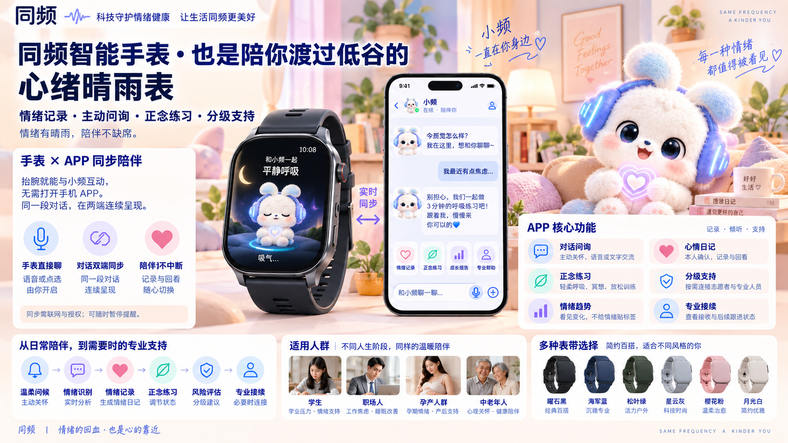
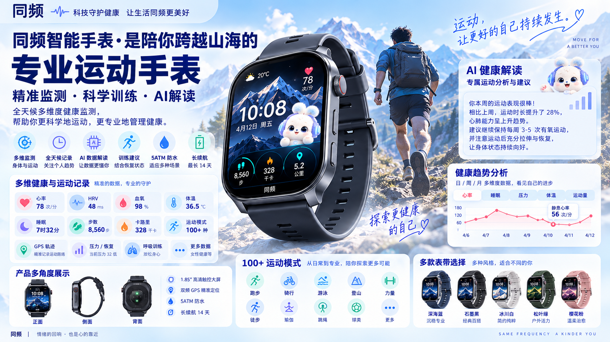

# 同频智能手表概念设计

归档日期：2026-09-09。两张图片来自用户提供的下载原文件，均为 **1672 × 941 PNG**，仅重命名归档，未压缩、裁剪或改图。此次上传为位图原图，不是分层设计工程或可运行的手表应用。

## 情绪陪伴版

[查看或下载原图](tongpin-watch-emotional-companion.png)

展示方向：小频腕端陪伴、主动问询、情绪日记、自愿跟练、手表与手机衔接、人工与专业支持接续。暖粉场景与现有小频形象相呼应。

## 运动健康版

[查看或下载原图](tongpin-watch-sports-health.png)

展示方向：户外运动、日常健康记录、趋势回顾、腕端小频、多色表带及手表多角度外观。蓝色山野场景属于运动版的视觉探索，不替代 App 已确定的暖色主界面。

## 与当前产品设计的关系

- 两张图为概念展示，不表示已经生产硬件、完成认证或上线相关服务。原图文字保持不变。
- 图中的屏幕尺寸、双频 GPS、5ATM 防水、14 天续航、100+ 运动模式及各监测能力均未在本项目完成验证，不作为规格承诺。
- 图中的心率、HRV、血氧、体温、睡眠、运动量与趋势百分比均为画面示例，不是实际患者数据、设备测试结果或转诊门槛。血氧、体温等仍按当前 PRD 的未启用扩展处理。
- “情绪识别”“风险评估”“实时同步”“全天候”等图示表达不代表现有 Demo 具备可靠识别、连续值守、真实双端同步或临床诊断能力。观察、量表与人工接续的边界以现行 PRD 和规则为准。
- 图示学生、孕产人群、中老年人等不代表这些人群已完成适用性验证或纳入上线范围；未成年人、特殊人群及身体能力差异仍需单独评审。
- 形象、人物及硬件外观素材的权利以原始来源许可为准，本次归档不另行授予第三方商用许可。

相关文档：[PRD V0.4](../../docs/product/PRD-v0.4.md) · [小频设计](../../docs/design/xiaopin.md) · [原型与硬件现状](../../docs/prototypes/README.md) · [数据与触发规则](../../docs/rules/trigger-rules-v0.4.md)

## 原文件对照

| 归档文件 | 下载原文件名 |
| --- | --- |
| `tongpin-watch-emotional-companion.png` | `ChatGPT Image 2026年9月9日 17_19_59.png` |
| `tongpin-watch-sports-health.png` | `ChatGPT Image 2026年9月9日 17_36_09.png` |

原图尺寸、文件大小及 SHA-256 记录见[文件校验清单](source-manifest.json)。本机下载原件保留不动。
