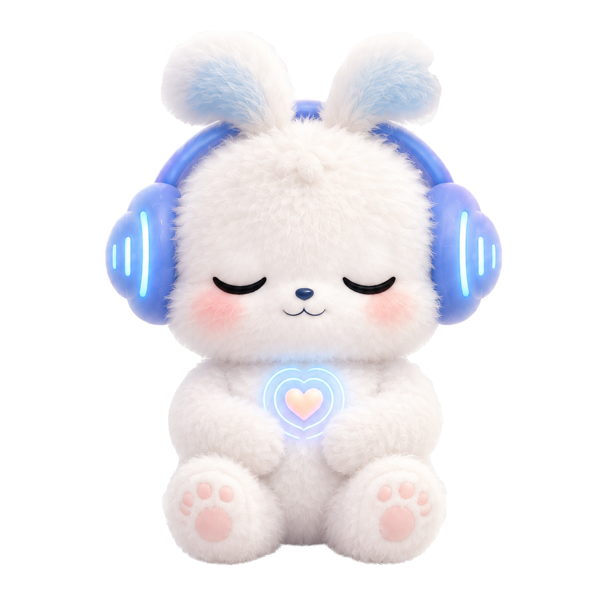

# 小频形象与交互设计

版本：2026-09-09 整理稿。当前主形象为毛茸茸的小频；早期三宠物方案只作探索档案。

## 主形象

白色长绒毛、短兔耳、大眼睛、蓝紫耳机、胸前爱心。保留主体中性白色，暖色来自背景，不给小频叠加黄色/粉色蒙版。角色图层置于背景色与光晕之上，禁止滤镜或半透明覆盖层把主体染色。

当前资产为真实 RGBA PNG，不是棋盘格模拟透明。招手适合首页与陪伴入口；平静姿态用于自愿跟练。缩放时完整保留耳朵与脚，减少动态模式下提供静态替代。

## 暖色系统

| 用途 | 色值 |
| --- | --- |
| 暖白背景 | #FFFBF5 |
| 淡粉卡片 | #FBE7EB |
| 鹅黄关怀/活动区域 | #FFF1BD |
| 深玫瑰主按钮 | #A94360 |
| 深梅色正文 | #503A46 |

状态不能只靠颜色区分，同时给文字与图标；错误与急症仍要清楚，不因暖色弱化。

## 陪伴与跟练

首页先问“现在想聊聊，还是安静待一会儿？”；日记为可编辑的观察草稿，确认后才保存为本人记录，另行决定是否分享摘要。不要使用“永远只有我陪你”“一切一定会好”等保证，不做不登录就惩罚宠物的机制。

原型提供自然舒缓呼吸、五感落地、肩颈/手部放松。允许暂停、跳过、停止；不要求强吸气、憋气或闭眼。不适加重时停止练习并提供现实帮助；当前身体急症或安全事件优先于跟练。演示节奏不等于疗程或治疗处方。

活动提醒先确认是否佩戴、是否休息/学习/生病及身体限制，再邀请自愿做合适活动。不把长时间不动直接写作精神疾病发作，不进行带病强制运动。

## 未成年人

用语简单、不幼稚化、不展示成人诊断标签。适龄授权与安全保护单独设计；支持可信成年人/专业帮助但不默认公开日记全文，不自动联系可能造成伤害的监护人。不同年龄内容与规则须分别审核。

## 资产来源与使用边界

用户提供形象参考后，使用生成工具生成招手与平静两姿态，再经用户明确授权在本地去背景并精修边缘。原始 RGB 棋盘格版本不是交付资产。两张当前 PNG 原样整理，不重新生成。

参考设计及衍生形象的知识产权尚未独立核验；本仓库不据此授予第三方商用许可，也不声称与 FUZOZO 有合作关系。对外品牌/商用发布前需核验参考图授权与角色权利。第三方参考原图、失败候选与模型权重未纳入发布包。
