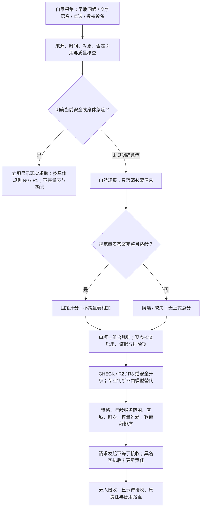
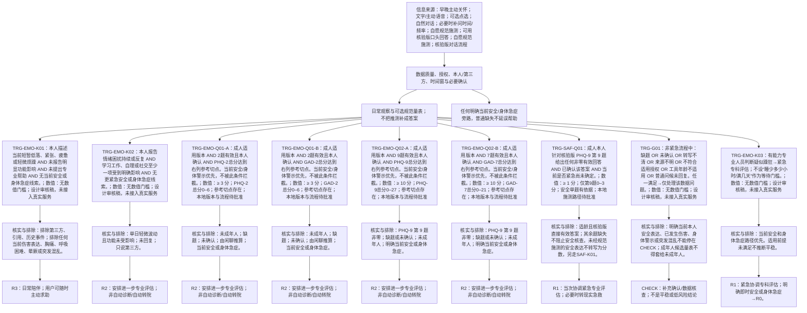
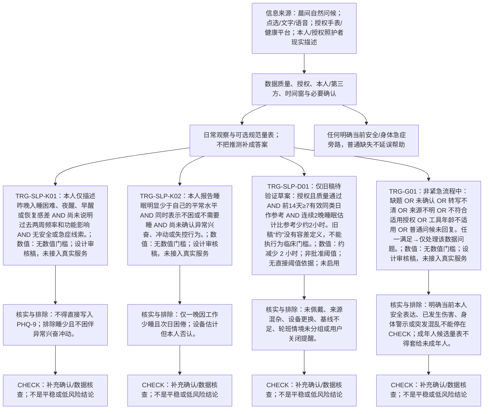
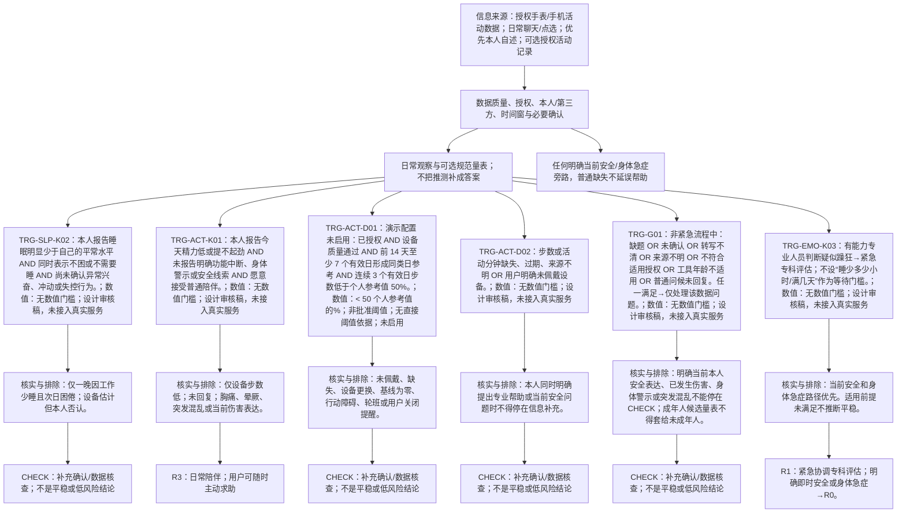
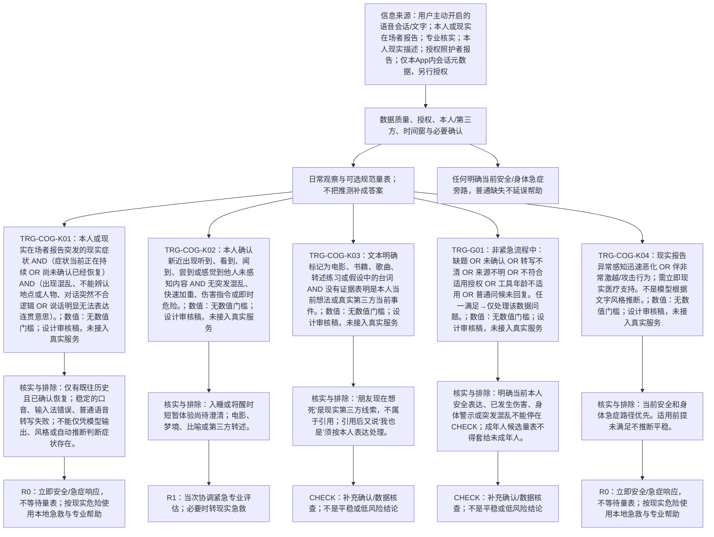
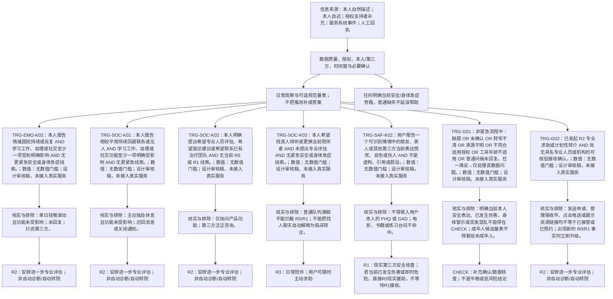
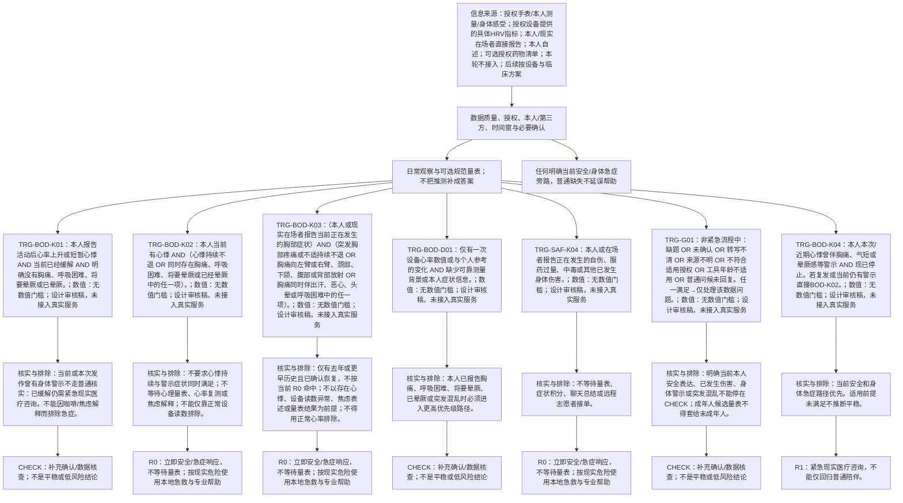
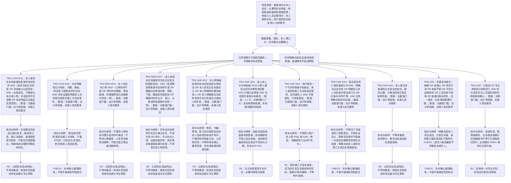
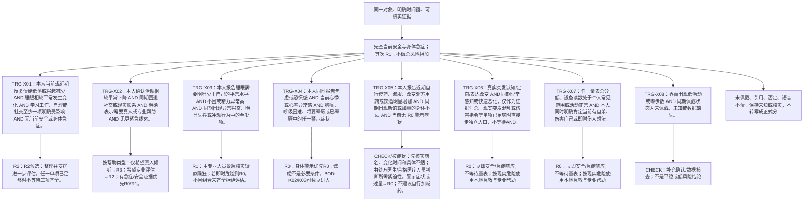

# 七模块数据与分诊流程 V0.4

版本：V0.4 · 2026-09-09。与双端 Profile Excel 同一规则清单。全部为产品设计与虚构情境，不是诊断、真实患者数据或已部署服务。

## 先读：数字、组合与响应的含义

- **参考切点**：外部研究或工具说明中用于筛查、进一步评估的参考值。只对该工具、版本、适用人群及规范施测结果有意义，不等于诊断或自动转诊批准。
- **候选参数**：同频拟议的产品提醒参数，缺少本产品验证与机构批准，保持未启用。例如睡眠/步数变化草案。写出数字不代表可直接执行。
- **单项触发**存在：明确当前安全表达、身体急症线索、安全单题阳性或一份完整量表达到参考切点，可独立进入核实或对应响应，不必等待其他模块。
- **组合触发**采用逐条 AND/OR 条件，不把情绪、步数、心率等相加。国际指南支持其中的症状评估或就医方向，并未验证“同频综合风险分”。每条规则分列来源实际支持内容与产品自定义缺口。
- **缺失不等于正常**：没戴手表不等于少动；没有回复不等于安全或发病；引用、否定、第三方描述不能填作本人正式量表答案。
- **安全旁路**：当前安全或身体急症不等待量表、Profile、设备复测、匹配分数或志愿者名额。已有安全事件不能被正常设备数据、评分下降或普通未回复自动关闭。
- **适龄边界**：成人规则不自动用于未成年人。工具医疗场景适用年龄、隐私保护年龄和成年年龄是不同概念。
- **响应出口**：CHECK 是补充核实；R0 即时安全/急症、R1 当次紧急专业评估、R2 进一步评估、R3 日常陪伴。它们是同频行动出口，不是国际统一风险等级，也不预测未来自杀。

## 1 总览

## 2 情绪体验

输入：[DAT-EMO-01](data-dictionary-v0.4.md#dat-emo-01)；[DAT-EMO-02](data-dictionary-v0.4.md#dat-emo-02)；[DAT-EMO-03](data-dictionary-v0.4.md#dat-emo-03)；[DAT-EMO-04](data-dictionary-v0.4.md#dat-emo-04)。

| 规则 | 条件 | 数值/范围 | 响应 | 责任 | 状态 |
| --- | --- | --- | --- | --- | --- |
| [TRG-EMO-K01](trigger-rules-v0.4.md#trg-emo-k01) | 本人描述当前短暂低落、紧张、疲惫或轻微烦躁 AND 未报告明显功能影响 AND 未提出专业帮助 AND 无当前安全或身体急症线索。 | 无数值门槛 | R3 | 用户端发起；小频提供可跳过的日常陪伴，用户可随时改选真人支持。 | 设计审核稿，未接入真实服务 |
| [TRG-EMO-K02](trigger-rules-v0.4.md#trg-emo-k02) | 本人报告情绪困扰持续或反复 AND 学习工作、自理或社交至少一项受到明确影响 AND 无更紧急安全或身体急症线索。 | 无数值门槛 | R2 | 志愿者可协助整理；专业人员评估支持计划，接收前保留当前责任。 | 设计审核稿，未接入真实服务 |
| [TRG-EMO-Q01-A](trigger-rules-v0.4.md#trg-emo-q01-a) | 成人适用版本 AND 2题有效且本人确认 AND PHQ-2总分达到右列参考切点。当前安全/身体警示优先，不被此条件拦截。 | ≥ 3 分；PHQ-2总分0–6 | R2 | 用户确认，固定程序计分；专业人员决定是否补长表或访谈。 | 参考切点存在；本地版本与流程待批准 |
| [TRG-EMO-Q01-B](trigger-rules-v0.4.md#trg-emo-q01-b) | 成人适用版本 AND 2题有效且本人确认 AND GAD-2总分达到右列参考切点。当前安全/身体警示优先，不被此条件拦截。 | ≥ 3 分；GAD-2总分0–6 | R2 | 用户确认，固定程序计分；专业人员决定是否补长表或访谈。 | 参考切点存在；本地版本与流程待批准 |
| [TRG-EMO-Q02-A](trigger-rules-v0.4.md#trg-emo-q02-a) | 成人适用版本 AND 9题有效且本人确认 AND PHQ-9总分达到右列参考切点。当前安全/身体警示优先，不被此条件拦截。 | ≥ 10 分；PHQ-9总分0–27 | R2 | 固定程序计分；专业人员结合功能、变化和本人意愿评估。 | 参考切点存在；本地版本与流程待批准 |
| [TRG-EMO-Q02-B](trigger-rules-v0.4.md#trg-emo-q02-b) | 成人适用版本 AND 7题有效且本人确认 AND GAD-7总分达到右列参考切点。当前安全/身体警示优先，不被此条件拦截。 | ≥ 10 分；GAD-7总分0–21 | R2 | 固定程序计分；专业人员结合功能、变化和本人意愿评估。 | 参考切点存在；本地版本与流程待批准 |
| [TRG-SAF-Q01](trigger-rules-v0.4.md#trg-saf-q01) | 成人本人针对核验版 PHQ-9 第 9 题给出任何非零有效回答 AND 已确认该答案 AND 当前是否紧急尚未确定。 | ≥ 1 分；仅第9题0–3分 | R1 | 固定程序识别单题；专业人员当次核查，普通志愿者可协助连接但不独立评估。 | 安全单题有依据；本地施测路径待批准 |
| [TRG-G01](trigger-rules-v0.4.md#trg-g01) | 非紧急流程中：缺题 OR 未确认 OR 转写不清 OR 来源不明 OR 不符合适用授权 OR 工具年龄不适用 OR 普通问候未回复。任一满足→仅处理该数据问题。 | 无数值门槛 | CHECK | 用户端确认数据；志愿者只看获授权摘要；管理端不得越权；专业需要不因缺失被拒绝。 | 设计审核稿，未接入真实服务 |
| [TRG-EMO-K03](trigger-rules-v0.4.md#trg-emo-k03) | 有能力专业人员判断疑似躁狂→紧急专科评估；不设“睡少多少小时/满几天”作为等待门槛。 | 无数值门槛 | R1 | 按角色权限执行；管理者协调，临床判断由专业人员负责。 | 设计审核稿，未接入真实服务 |

## 3 睡眠与节律

输入：[DAT-SLP-01](data-dictionary-v0.4.md#dat-slp-01)；[DAT-SLP-02](data-dictionary-v0.4.md#dat-slp-02)；[DAT-SLP-03](data-dictionary-v0.4.md#dat-slp-03)。

| 规则 | 条件 | 数值/范围 | 响应 | 责任 | 状态 |
| --- | --- | --- | --- | --- | --- |
| [TRG-SLP-K01](trigger-rules-v0.4.md#trg-slp-k01) | 本人仅描述昨晚入睡困难、夜醒、早醒或恢复感差 AND 尚未说明过去两周频率和功能影响 AND 无安全或急症线索。 | 无数值门槛 | CHECK | 用户端确认；小频只补充情境，不自动开启正式量表。 | 设计审核稿，未接入真实服务 |
| [TRG-SLP-K02](trigger-rules-v0.4.md#trg-slp-k02) | 本人报告睡眠明显少于自己的平常水平 AND 同时表示不困或不需要睡 AND 尚未确认异常兴奋、冲动或失控行为。 | 无数值门槛 | CHECK | 小频补充必要事实；已有临床怀疑或担忧可直接由专业人员接续，不等待凑齐组合。 | 设计审核稿，未接入真实服务 |
| [TRG-SLP-D01](trigger-rules-v0.4.md#trg-slp-d01) | 仅旧稿待验证草案：授权且质量通过 AND 前14天≥7有效同类日作参考 AND 连续2晚睡眠估计比参考少约2小时。旧稿“约”没有容差定义，不能执行为临床门槛。 | 约减少 2 小时；非批准阈值 | CHECK | 用户端确认；管理端仅维护配置和审计，不据此调整支持标签。 | 无直接阈值依据；未启用 |
| [TRG-G01](trigger-rules-v0.4.md#trg-g01) | 非紧急流程中：缺题 OR 未确认 OR 转写不清 OR 来源不明 OR 不符合适用授权 OR 工具年龄不适用 OR 普通问候未回复。任一满足→仅处理该数据问题。 | 无数值门槛 | CHECK | 用户端确认数据；志愿者只看获授权摘要；管理端不得越权；专业需要不因缺失被拒绝。 | 设计审核稿，未接入真实服务 |

## 4 精力与活动

输入：[DAT-ACT-01](data-dictionary-v0.4.md#dat-act-01)；[DAT-ACT-02](data-dictionary-v0.4.md#dat-act-02)；[DAT-ACT-03](data-dictionary-v0.4.md#dat-act-03)。

| 规则 | 条件 | 数值/范围 | 响应 | 责任 | 状态 |
| --- | --- | --- | --- | --- | --- |
| [TRG-SLP-K02](trigger-rules-v0.4.md#trg-slp-k02) | 本人报告睡眠明显少于自己的平常水平 AND 同时表示不困或不需要睡 AND 尚未确认异常兴奋、冲动或失控行为。 | 无数值门槛 | CHECK | 小频补充必要事实；已有临床怀疑或担忧可直接由专业人员接续，不等待凑齐组合。 | 设计审核稿，未接入真实服务 |
| [TRG-ACT-K01](trigger-rules-v0.4.md#trg-act-k01) | 本人报告今天精力低或提不起劲 AND 未报告明确功能中断、身体警示或安全线索 AND 愿意接受普通陪伴。 | 无数值门槛 | R3 | 用户端选择；小频不强推活动，志愿者按需陪伴。 | 设计审核稿，未接入真实服务 |
| [TRG-ACT-D01](trigger-rules-v0.4.md#trg-act-d01) | 演示配置 未启用：已授权 AND 设备质量通过 AND 前 14 天至少 7 个有效日形成同类日参考 AND 连续 3 个有效日步数低于个人参考值 50%。 | < 50 个人参考值的%；非批准阈值 | CHECK | 用户端确认；管理端维护配置和数据质量，不能据此自动转诊。 | 无直接阈值依据；未启用 |
| [TRG-ACT-D02](trigger-rules-v0.4.md#trg-act-d02) | 步数或活动分钟缺失、过期、来源不明 OR 用户明确未佩戴设备。 | 无数值门槛 | CHECK | 小频标注质量；用户仍保留全部主动求助入口。 | 设计审核稿，未接入真实服务 |
| [TRG-G01](trigger-rules-v0.4.md#trg-g01) | 非紧急流程中：缺题 OR 未确认 OR 转写不清 OR 来源不明 OR 不符合适用授权 OR 工具年龄不适用 OR 普通问候未回复。任一满足→仅处理该数据问题。 | 无数值门槛 | CHECK | 用户端确认数据；志愿者只看获授权摘要；管理端不得越权；专业需要不因缺失被拒绝。 | 设计审核稿，未接入真实服务 |
| [TRG-EMO-K03](trigger-rules-v0.4.md#trg-emo-k03) | 有能力专业人员判断疑似躁狂→紧急专科评估；不设“睡少多少小时/满几天”作为等待门槛。 | 无数值门槛 | R1 | 按角色权限执行；管理者协调，临床判断由专业人员负责。 | 设计审核稿，未接入真实服务 |

## 5 对话与认知

输入：[DAT-COG-01](data-dictionary-v0.4.md#dat-cog-01)；[DAT-COG-02](data-dictionary-v0.4.md#dat-cog-02)；[DAT-COG-03](data-dictionary-v0.4.md#dat-cog-03)；[DAT-COG-04](data-dictionary-v0.4.md#dat-cog-04)。

| 规则 | 条件 | 数值/范围 | 响应 | 责任 | 状态 |
| --- | --- | --- | --- | --- | --- |
| [TRG-COG-K01](trigger-rules-v0.4.md#trg-cog-k01) | 本人或现实在场者报告突发的现实症状 AND（症状当前正在持续 OR 尚未确认已经恢复）AND（出现混乱、不能辨认地点或人物、对话突然不合逻辑 OR 说话明显无法表达连贯意思）。 | 无数值门槛 | R0 | 用户端突出 120 等现实医疗急救；专业人员按机构流程协同，普通志愿者不独立判断病因。 | 设计审核稿，未接入真实服务 |
| [TRG-COG-K02](trigger-rules-v0.4.md#trg-cog-k02) | 本人确认新近出现听到、看到、闻到、尝到或感觉到他人未感知内容 AND 无突发混乱、快速加重、伤害指令或即时危险。 | 无数值门槛 | R1 | 当次协调专业评估；未接收时保留当前责任并展示备用现实路径。 | 设计审核稿，未接入真实服务 |
| [TRG-COG-K03](trigger-rules-v0.4.md#trg-cog-k03) | 文本明确标记为电影、书籍、歌曲、转述练习或假设中的台词 AND 没有证据表明是本人当前想法或真实第三方当前事件。 | 无数值门槛 | CHECK | 小频保留语境标记；用户可纠正，志愿者看到的摘要不得改写为本人安全阳性。 | 设计审核稿，未接入真实服务 |
| [TRG-G01](trigger-rules-v0.4.md#trg-g01) | 非紧急流程中：缺题 OR 未确认 OR 转写不清 OR 来源不明 OR 不符合适用授权 OR 工具年龄不适用 OR 普通问候未回复。任一满足→仅处理该数据问题。 | 无数值门槛 | CHECK | 用户端确认数据；志愿者只看获授权摘要；管理端不得越权；专业需要不因缺失被拒绝。 | 设计审核稿，未接入真实服务 |
| [TRG-COG-K04](trigger-rules-v0.4.md#trg-cog-k04) | 现实报告异常感知迅速恶化 OR 伴非常激越/攻击行为；需立即现实医疗支持。不是模型根据文字风格推断。 | 无数值门槛 | R0 | 按角色权限执行；管理者协调，临床判断由专业人员负责。 | 设计审核稿，未接入真实服务 |

## 6 社交与功能

输入：[DAT-SOC-01](data-dictionary-v0.4.md#dat-soc-01)；[DAT-SOC-02](data-dictionary-v0.4.md#dat-soc-02)；[DAT-SOC-03](data-dictionary-v0.4.md#dat-soc-03)。

| 规则 | 条件 | 数值/范围 | 响应 | 责任 | 状态 |
| --- | --- | --- | --- | --- | --- |
| [TRG-EMO-K02](trigger-rules-v0.4.md#trg-emo-k02) | 本人报告情绪困扰持续或反复 AND 学习工作、自理或社交至少一项受到明确影响 AND 无更紧急安全或身体急症线索。 | 无数值门槛 | R2 | 志愿者可协助整理；专业人员评估支持计划，接收前保留当前责任。 | 设计审核稿，未接入真实服务 |
| [TRG-SOC-K01](trigger-rules-v0.4.md#trg-soc-k01) | 本人报告相较平常持续回避联系或见人 AND 学习工作、自理或社交功能至少一项明确受影响 AND 无更紧急线索。 | 无数值门槛 | R2 | 志愿者可陪伴并整理需求；专业人员评估后续计划。 | 设计审核稿，未接入真实服务 |
| [TRG-SOC-K02](trigger-rules-v0.4.md#trg-soc-k02) | 本人明确提出希望专业人员评估、希望就诊建议或希望联系已有治疗团队 AND 无当前 R0 或 R1 线索。 | 无数值门槛 | R2 | 志愿者或小频协助发起；专业接收前原责任不释放，公开资源不等于预约。 | 设计审核稿，未接入真实服务 |
| [TRG-SOC-K03](trigger-rules-v0.4.md#trg-soc-k03) | 本人希望找真人倾听或更换当前陪伴者 AND 未提出专业评估 AND 无紧急安全或身体急症线索。 | 无数值门槛 | R3 | 志愿者端按资格和容量承接；管理端只协调，不默认查看全文。 | 设计审核稿，未接入真实服务 |
| [TRG-SAF-K02](trigger-rules-v0.4.md#trg-saf-k02) | 用户报告一个可识别情境中的朋友、家人或其他第三方当前表达想死、自伤或伤人 AND 不是虚构、引用或假设。 | 无数值门槛 | R1 | 专业人员为用户提供针对第三方的安全指导；即时危险时提示联系当地急救或公共安全渠道。 | 设计审核稿，未接入真实服务 |
| [TRG-G01](trigger-rules-v0.4.md#trg-g01) | 非紧急流程中：缺题 OR 未确认 OR 转写不清 OR 来源不明 OR 不符合适用授权 OR 工具年龄不适用 OR 普通问候未回复。任一满足→仅处理该数据问题。 | 无数值门槛 | CHECK | 用户端确认数据；志愿者只看获授权摘要；管理端不得越权；专业需要不因缺失被拒绝。 | 设计审核稿，未接入真实服务 |
| [TRG-G02](trigger-rules-v0.4.md#trg-g02) | 已发起 R2 专业求助或计划性转介 AND 尚无具名专业人员或机构的可核验接收确认。 | 无数值门槛 | R2 | 原责任人继续负责已承诺范围；管理端协调备援；专业人员或机构确认后才更新接收状态。 | 设计审核稿，未接入真实服务 |

## 7 身体与生活

输入：[DAT-BOD-01](data-dictionary-v0.4.md#dat-bod-01)；[DAT-BOD-02](data-dictionary-v0.4.md#dat-bod-02)；[DAT-BOD-03](data-dictionary-v0.4.md#dat-bod-03)；[DAT-BOD-04](data-dictionary-v0.4.md#dat-bod-04)；[DAT-BOD-05](data-dictionary-v0.4.md#dat-bod-05)。

| 规则 | 条件 | 数值/范围 | 响应 | 责任 | 状态 |
| --- | --- | --- | --- | --- | --- |
| [TRG-BOD-K01](trigger-rules-v0.4.md#trg-bod-k01) | 本人报告活动后心率上升或短暂心悸 AND 当前已经缓解 AND 明确没有胸痛、呼吸困难、将要晕厥或已晕厥。 | 无数值门槛 | CHECK | 用户端补充；小频不诊断，必要时提示联系现实医疗人员。 | 设计审核稿，未接入真实服务 |
| [TRG-BOD-K02](trigger-rules-v0.4.md#trg-bod-k02) | 本人当前有心悸 AND（心悸持续不退 OR 同时存在胸痛、呼吸困难、将要晕厥或已经晕厥中的任一项）。 | 无数值门槛 | R0 | 用户端突出 120 等现实医疗急救；专业人员按本地协议协同，普通志愿者不单独处置。 | 设计审核稿，未接入真实服务 |
| [TRG-BOD-K03](trigger-rules-v0.4.md#trg-bod-k03) | （本人或现实在场者报告当前正在发生的胸部症状）AND（突发胸部疼痛或不适持续不退 OR 胸痛向左臂或右臂、颈部、下颌、腹部或背部放射 OR 胸痛同时伴出汗、恶心、头晕或呼吸困难中的任一项）。 | 无数值门槛 | R0 | 用户端突出 120 等现实医疗急救；专业人员按本地协议协同，普通志愿者不单独判断原因。 | 设计审核稿，未接入真实服务 |
| [TRG-BOD-D01](trigger-rules-v0.4.md#trg-bod-d01) | 仅有一次设备心率数值或与个人参考的变化 AND 缺少可靠测量背景或本人症状信息。 | 无数值门槛 | CHECK | 小频标注信息不足；用户可联系现实医疗人员，管理端不得用读数自动改支持标签。 | 设计审核稿，未接入真实服务 |
| [TRG-SAF-K04](trigger-rules-v0.4.md#trg-saf-k04) | 本人或在场者报告正在发生的自伤、服药过量、中毒或其他已发生身体伤害。 | 无数值门槛 | R0 | 用户端突出 120；具备权限的专业人员按协议协同，信息披露须有适用依据和审计。 | 设计审核稿，未接入真实服务 |
| [TRG-G01](trigger-rules-v0.4.md#trg-g01) | 非紧急流程中：缺题 OR 未确认 OR 转写不清 OR 来源不明 OR 不符合适用授权 OR 工具年龄不适用 OR 普通问候未回复。任一满足→仅处理该数据问题。 | 无数值门槛 | CHECK | 用户端确认数据；志愿者只看获授权摘要；管理端不得越权；专业需要不因缺失被拒绝。 | 设计审核稿，未接入真实服务 |
| [TRG-BOD-K04](trigger-rules-v0.4.md#trg-bod-k04) | 本人本次/近期心悸曾伴胸痛、气短或晕厥感等警示 AND 现已停止。若复发或当前仍有警示直接BOD-K02。 | 无数值门槛 | R1 | 按角色权限执行；管理者协调，临床判断由专业人员负责。 | 设计审核稿，未接入真实服务 |

## 8 风险信息

输入：[DAT-SAF-01](data-dictionary-v0.4.md#dat-saf-01)；[DAT-SAF-02](data-dictionary-v0.4.md#dat-saf-02)；[DAT-SAF-03](data-dictionary-v0.4.md#dat-saf-03)；[DAT-SAF-04](data-dictionary-v0.4.md#dat-saf-04)。

| 规则 | 条件 | 数值/范围 | 响应 | 责任 | 状态 |
| --- | --- | --- | --- | --- | --- |
| [TRG-COG-K01](trigger-rules-v0.4.md#trg-cog-k01) | 本人或现实在场者报告突发的现实症状 AND（症状当前正在持续 OR 尚未确认已经恢复）AND（出现混乱、不能辨认地点或人物、对话突然不合逻辑 OR 说话明显无法表达连贯意思）。 | 无数值门槛 | R0 | 用户端突出 120 等现实医疗急救；专业人员按机构流程协同，普通志愿者不独立判断病因。 | 设计审核稿，未接入真实服务 |
| [TRG-COG-K03](trigger-rules-v0.4.md#trg-cog-k03) | 文本明确标记为电影、书籍、歌曲、转述练习或假设中的台词 AND 没有证据表明是本人当前想法或真实第三方当前事件。 | 无数值门槛 | CHECK | 小频保留语境标记；用户可纠正，志愿者看到的摘要不得改写为本人安全阳性。 | 设计审核稿，未接入真实服务 |
| [TRG-BOD-K02](trigger-rules-v0.4.md#trg-bod-k02) | 本人当前有心悸 AND（心悸持续不退 OR 同时存在胸痛、呼吸困难、将要晕厥或已经晕厥中的任一项）。 | 无数值门槛 | R0 | 用户端突出 120 等现实医疗急救；专业人员按本地协议协同，普通志愿者不单独处置。 | 设计审核稿，未接入真实服务 |
| [TRG-BOD-K03](trigger-rules-v0.4.md#trg-bod-k03) | （本人或现实在场者报告当前正在发生的胸部症状）AND（突发胸部疼痛或不适持续不退 OR 胸痛向左臂或右臂、颈部、下颌、腹部或背部放射 OR 胸痛同时伴出汗、恶心、头晕或呼吸困难中的任一项）。 | 无数值门槛 | R0 | 用户端突出 120 等现实医疗急救；专业人员按本地协议协同，普通志愿者不单独判断原因。 | 设计审核稿，未接入真实服务 |
| [TRG-SAF-K01](trigger-rules-v0.4.md#trg-saf-k01) | 本人明确肯定现在有自杀或结束生命想法 OR 本人现在正在伤害自己 OR 本人明确现在要伤害他人 OR 本人明确报告当前听到命令自己伤害自己或他人的声音。 | 无数值门槛 | R0 | 用户端停止非必要流程并突出现实渠道；专业人员接续，接收前原责任与备用路径保持可见。 | 设计审核稿，未接入真实服务 |
| [TRG-SAF-Q01](trigger-rules-v0.4.md#trg-saf-q01) | 成人本人针对核验版 PHQ-9 第 9 题给出任何非零有效回答 AND 已确认该答案 AND 当前是否紧急尚未确定。 | ≥ 1 分；仅第9题0–3分 | R1 | 固定程序识别单题；专业人员当次核查，普通志愿者可协助连接但不独立评估。 | 安全单题有依据；本地施测路径待批准 |
| [TRG-SAF-K02](trigger-rules-v0.4.md#trg-saf-k02) | 用户报告一个可识别情境中的朋友、家人或其他第三方当前表达想死、自伤或伤人 AND 不是虚构、引用或假设。 | 无数值门槛 | R1 | 专业人员为用户提供针对第三方的安全指导；即时危险时提示联系当地急救或公共安全渠道。 | 设计审核稿，未接入真实服务 |
| [TRG-SAF-K03](trigger-rules-v0.4.md#trg-saf-k03) | 表达包含死亡或伤害相关词 AND（明确为过去历史 OR 明确否认本人当前相关想法或行为 OR 对象与时间不清）AND 没有明确当前肯定证据。 | 无数值门槛 | CHECK | 小频或志愿者补充信息；必要时交专业人员，不自动写量表答案。 | 设计审核稿，未接入真实服务 |
| [TRG-SAF-K04](trigger-rules-v0.4.md#trg-saf-k04) | 本人或在场者报告正在发生的自伤、服药过量、中毒或其他已发生身体伤害。 | 无数值门槛 | R0 | 用户端突出 120；具备权限的专业人员按协议协同，信息披露须有适用依据和审计。 | 设计审核稿，未接入真实服务 |
| [TRG-G01](trigger-rules-v0.4.md#trg-g01) | 非紧急流程中：缺题 OR 未确认 OR 转写不清 OR 来源不明 OR 不符合适用授权 OR 工具年龄不适用 OR 普通问候未回复。任一满足→仅处理该数据问题。 | 无数值门槛 | CHECK | 用户端确认数据；志愿者只看获授权摘要；管理端不得越权；专业需要不因缺失被拒绝。 | 设计审核稿，未接入真实服务 |
| [TRG-G02](trigger-rules-v0.4.md#trg-g02) | 已发起 R2 专业求助或计划性转介 AND 尚无具名专业人员或机构的可核验接收确认。 | 无数值门槛 | R2 | 原责任人继续负责已承诺范围；管理端协调备援；专业人员或机构确认后才更新接收状态。 | 设计审核稿，未接入真实服务 |

## 9 组合触发与优先顺序

| 组合规则 | 依据及缺口 | 状态 |
| --- | --- | --- |
| [TRG-X01](trigger-rules-v0.4.md#trg-x01) | 这些是综合评估的相关要素。 来源不支持“三项必须齐全才能转介”；本组合仅提示进一步核实，不能作唯一门槛。 | 设计审核稿，未接入真实服务 |
| [TRG-X02](trigger-rules-v0.4.md#trg-x02) | 指南关注活动、社会支持与功能。 原稿把真人或专业帮助均列R2，本表修订为按本人需求区分；活动与社交不是求助的前置门槛。 | 设计审核稿，未接入真实服务 |
| [TRG-X03](trigger-rules-v0.4.md#trg-x03) | 临床怀疑躁狂时应紧急转专科。 指南支持“临床怀疑躁狂→紧急专科评估”，不是验证三项AND；不以少睡小时数确诊，也不要求等待4天。 | 设计审核稿，未接入真实服务 |
| [TRG-X04](trigger-rules-v0.4.md#trg-x04) | 身体警示本身足以触发即时医疗路径。 焦虑不是必要前提，也不能使身体急症降级。此组合不应遮挡BOD独立入口。 | 设计审核稿，未接入真实服务 |
| [TRG-X05](trigger-rules-v0.4.md#trg-x05) | 需了解物质/药物情境，依据具体症状处理。 无统一“任何用药变更+任何不适一律R1”依据；按严重度与具体药物核实。 | 原统一R1缺乏依据；本表提出修订 |
| [TRG-X06](trigger-rules-v0.4.md#trg-x06) | 突发混乱、言语明显不连贯或异常感知快速恶化为急症线索。 组合不是额外必要门槛；转写错误、口音、模型文风判断不得命中急症。 | 设计审核稿，未接入真实服务 |
| [TRG-X07](trigger-rules-v0.4.md#trg-x07) | 不用总体风险分层决定服务；当前安全需要应优先。 不是低分加危险词的数值模型，正常数据没有抵消权重。 | 设计审核稿，未接入真实服务 |
| [TRG-X08](trigger-rules-v0.4.md#trg-x08) | 数据来源与不确定性应透明。 应阻断活动恶化推断，不阻断其他来源的危险事实。 | 设计审核稿，未接入真实服务 |

## 双端 Profile 的位置

Profile 是服务适配与权限过滤，不是第八个临床模块。完整 7 条 MATCH 规则见[双端档案与匹配](../product/profiles-and-matching.md)。当前安全响应不等待匹配。
